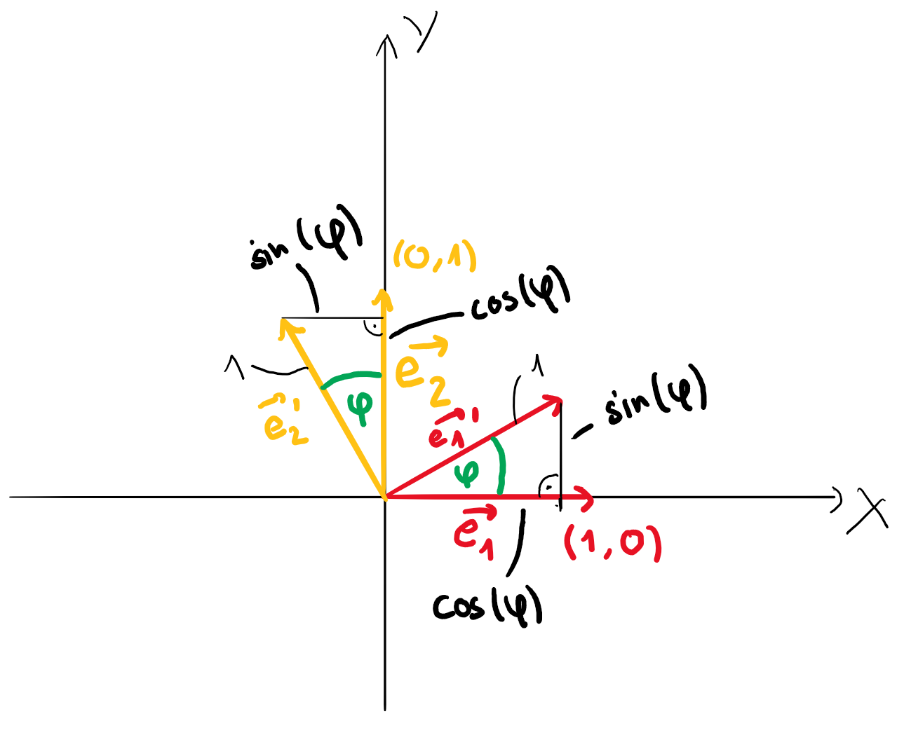
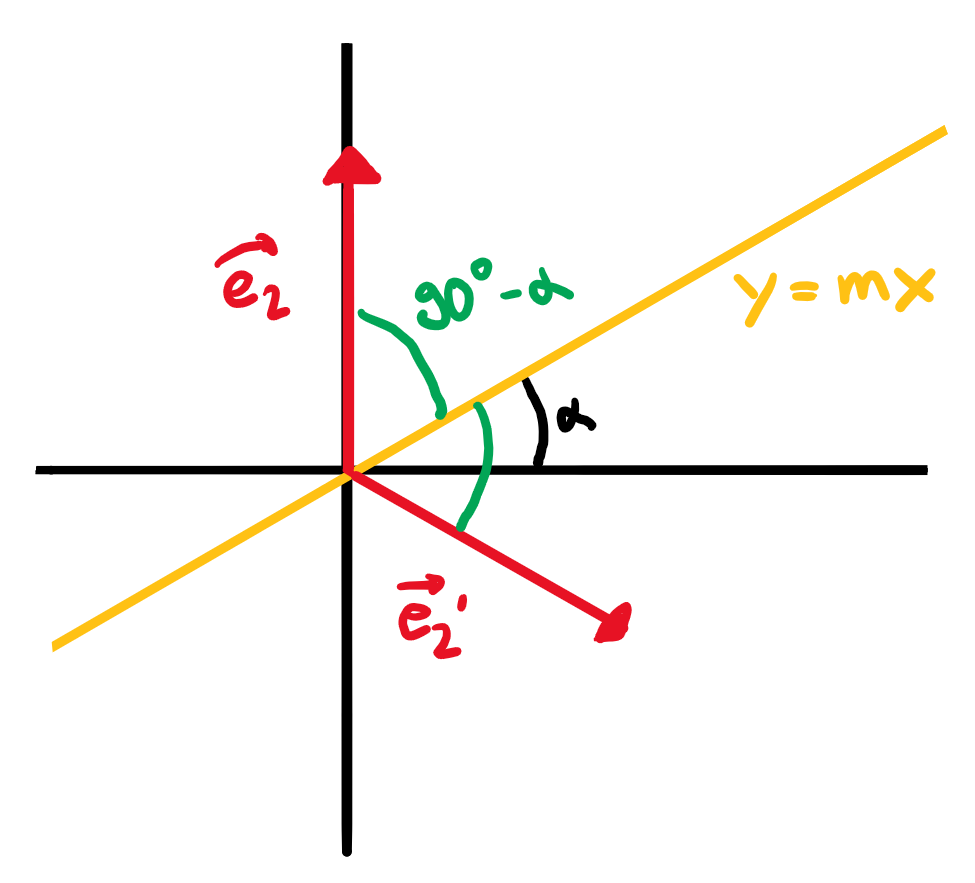

# Lineare Abbildungen

## Allgemein

### Definition

Für eine Lineare Abbildung $\alpha$ mit den Vektoren $\vec{p}$ und $\vec{q}$ gelten (Die eigentliche Definition):

$$\begin{align}
	\alpha(c\cdot\vec{p})&=c\cdot\alpha(\vec{p})&&\textrm{(I.)}\\
	\alpha(\vec{p}+\vec{q})&=\alpha(\vec{p})+\alpha(\vec{q})&&\textrm{(II.)}
\end{align}$$

Aus diesen Bedingungen folgt eine dritte Bedingung:

$$\alpha(a\cdot\vec{p}+b\cdot\vec{q})=a\cdot\alpha(\vec{p})+b\cdot\alpha(\vec{q})\;\;\textrm{(III.)}$$

Sie wird wie folgt bewiesen:

* $\textrm{I. + II.}\implies\textrm{III.}\;\textrm{mit}\;\vec{v}=a\cdot\vec{p}; \;\vec{u}=b\cdot\vec{q}$

$$\begin{align}
	\alpha(\vec{v}+\vec{u})&\stackrel{\textrm{II.}}{=}\alpha(\vec{v})+\alpha(\vec{u})\\
	&=\alpha(a\cdot\vec{p})+\alpha(b\cdot\vec{q})\\
	&\stackrel{\textrm{I.}}{=}a\cdot\alpha(\vec{p})+b\cdot\alpha(\vec{q})
\end{align}$$

* $\textrm{III.}\implies\textrm{I.}\;\textrm{mit}\;b=0; \;a\in\mathbb{R}$

$$\begin{align}
	\alpha(a\cdot\vec{p} +b\cdot\vec{q})&=a\cdot\alpha(\vec{p})+b\cdot\alpha(\vec{p})\\
	&= a\cdot\alpha (\vec{p})+0\cdot\alpha(\vec{p})\\
	&=a\cdot\alpha (\vec{p})
\end{align}$$

$$

* $\textrm{III.}\implies\textrm{II.}\;\textrm{mit}\;a=b=1$

$$\begin{align}
	\alpha(a\cdot\vec{p} +b\cdot\vec{q})&=a\cdot\alpha(\vec{p})+b\cdot\alpha(\vec{q})\\
	&=\alpha(\vec{p}) +\alpha(\vec{q})
\end{align}$$

Lineare Abbildungen $\alpha$ haben also die folgende Form:

$$\begin{align}
	x'&=a\cdot x + b\cdot y\\
	y'&=c\cdot x + d\cdot y\\
\end{align}$$

Beweise:

* $\alpha$ erfüllt $\textrm{I.}$ mit $\vec{p}=\begin{pmatrix} p_x\\p_y\end{pmatrix}; \;\vec{q}=\begin{pmatrix}
q_x\\q_y\end{pmatrix}$:

$$\begin{align}
	\alpha\left(\begin{pmatrix}p_x+q_x\\p_y+q_y\end{pmatrix}\right)&=\begin{pmatrix}a(p_x+q_x)+b(p_y+q_y)\\c(p_x+q_x)+d(p_y+q_y)\end{pmatrix}\\
	&=\begin{pmatrix}ap_x+bp_y\\cp_x+dp_y\end{pmatrix}+\begin{pmatrix}aq_x+bq_y\\cq_x+dq_y\end{pmatrix}\\
	&=\alpha(\vec{p})+\alpha(\vec{q})
\end{align}$$

* $\alpha$ erfüllt $\textrm{II.}$ mit $\vec{p}=\begin{pmatrix} p_x\\p_y\end{pmatrix}; \;\vec{q}=\begin{pmatrix}
q_x\\q_y\end{pmatrix}$:

$$\begin{align}
	\alpha(k\cdot\vec{p})&=\alpha\left(\begin{pmatrix}kp_x\\kp_y\end{pmatrix}\right)\\
	&=\begin{pmatrix} kap_x +kbp_y\\kcp_x+kdp_y \end{pmatrix}\\
	&=k\begin{pmatrix}ap_x+bp_y\\cp_x+dp_y\end{pmatrix}\\
&=k\alpha(\vec{p})
\end{align}$$

### Basisvektoren

Die Basisvektoren $\vec{e_1}=\begin{pmatrix}1\\0\end{pmatrix}$ und $\vec{e_2}=\begin{pmatrix}0\\1\end{pmatrix}$ haben die Abbildungen (So kann man $a$, $b$, $c$ und $d$ einfach bestimmen, weil man schaut, wo die Basisvektoren landen sollten):

$$\begin{align}
	\alpha(\vec{e_1})= \begin{pmatrix}a\\c\end{pmatrix}\\
	\alpha(\vec{e_2})= \begin{pmatrix}b\\d\end{pmatrix}
\end{align}$$

### Fixpunkte

Für Fixpunkte gilt:

$$\begin{align}
	x&=a\cdot x + b\cdot y\\
	y&=c\cdot x + d\cdot y
\end{align}$$

### Determinante

Für die Determinante $\Delta$ gilt:

$$\Delta = a\cdot d - b\cdot c$$

Die Determinante entsteht auch beim Kreuzprodukt der abgebildeten Basisvektoren. Sie hat also folgende geometrische Bedeutungen für die Abbildung:

1.  Die Bildfigur hat eine um $\Delta$ grössere Fläche (Beweise mit Vergleich der Dreiecksfläche der tatsächlichen Basisvektoren mit derjenigen der abgebildeten Basisvektoren)
2.  Die Bildfigur ändert den Drehsinn, wenn $\Delta<0$

### Umkehrabbildung

Um die Umkehrabbildung $\alpha^{-1}$ zu bestimmen, vertauscht man $x$ und $y$ mit $x'$ und $y'$ und löst dann nach $x'$ und $y'$ auf. Oder allgemein:

$$\begin{align}
	x'&=\frac{1}{\Delta}(d\cdot x - b\cdot y)\\
	y'&=\frac{1}{\Delta}(-c\cdot x + a\cdot y)
\end{align}$$

Umkehrabbildungen existieren also nur dann, wenn $\Delta\not=0$ gilt. 

### Verkettungen

Für Verkettungen $\alpha\circ\beta$:

$$\alpha\circ\beta=\alpha(\beta(\vec{p}))$$

## Spezielle Abbildungen

### Drehung um den Origo

Für die Drehung mit Winkel $\varphi$ um den Origo gilt:

$$\begin{align}
	x'&=\cos(\varphi)\cdot x - \sin(\varphi)\cdot y\\
	y'&=\sin(\varphi)\cdot x + \cos(\varphi)\cdot y
\end{align}$$

### Spiegelung an einer Gerade

Für die Spiegelung an einer Gerade mit dem Neigungswinkel $\alpha$ gilt:

$$\begin{align}
	x'&=\cos(2\alpha)\cdot x + \sin(2\alpha)\cdot y\\
	y'&=\sin(2\alpha)\cdot x - \cos(2\alpha)\cdot y
\end{align}$$

### Gleichung von gedrehten Funktionen und Relationen

Wenn wir die Funktion $f(x)$ (z. B. $y=\frac{1}{2}x^2$) um den Winkel $\varphi$ drehen wollen (also die Relation $r(x)$ gefunden werden soll), dann geht man wie folgt vor:

Man geht rückwärts von der Relation $r(x)$ auf die Funktion $f(x)$, weil die Funktionsgleichung schon gegeben ist:

$$\begin{align}
	x'&=\cos(-\varphi)\cdot x - \sin(-\varphi)\cdot y\\
	y'&=\sin(-\varphi)\cdot x + \cos(-\varphi)\cdot y
\end{align}$$

Jetzt ersetzt man $x$ und $y$ aus der Funktion (z. B. $y=\frac{1}{2}x^2$) mit den erhaltenen $x'$ und $y'$, z. B.:

$$(\sin(-\varphi)\cdot x + \cos(-\varphi)\cdot y )= \frac{1}{2}(\cos(-\varphi)\cdot x - \sin(-\varphi)\cdot y)^2$$

