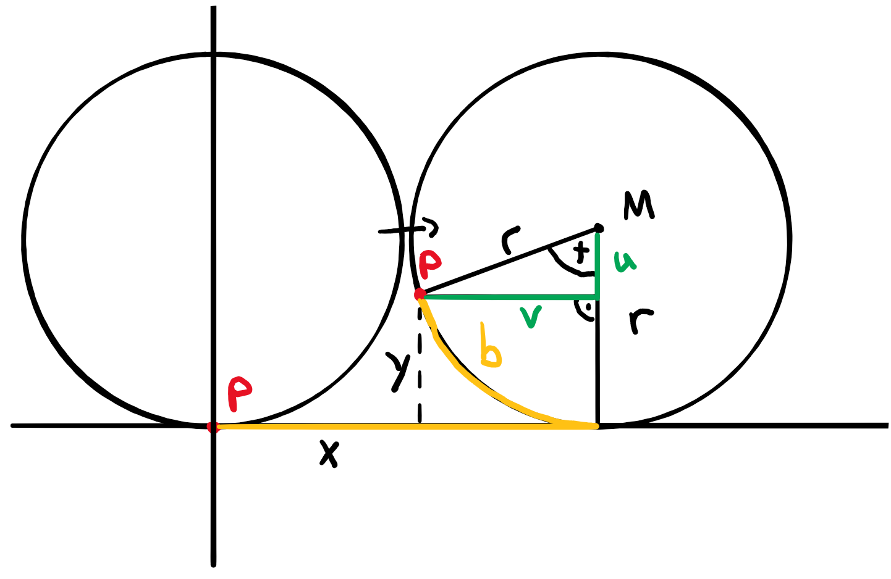
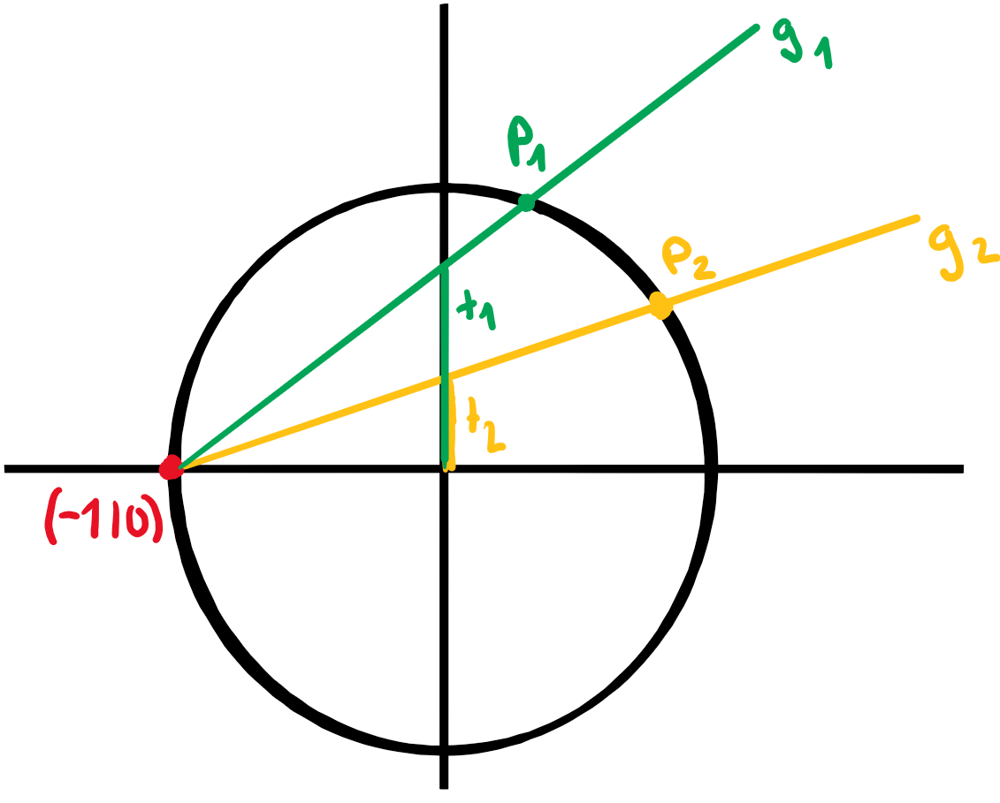
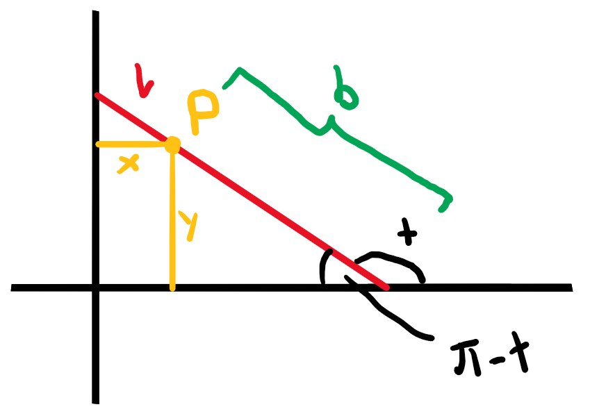

# Parameterfunktionen

## Allgemein

### Definition

Bei Parameterfunktionen werden die Koordinaten $x$ und $y$ mit Hilfe eines Parameters $t$ definiert. Für einen Punkt $P$ gilt also:

$$P(x(t)|y(t))$$

### Kreise und Ellipsen

Ellipsen bzw. Kreise mit Hauptachse $a$, Nebenachse $b$ und Mittelpunkt $M=(x_M|y_M)$ hadie Parameterfunktion:

$$\begin{align}
	x(t)&=x_M+a\cdot\cos(t)\\
	y(t)&=y_M+b\cdot\sin(t)
\end{align}$$

### Geschwindigkeit

Für die durchschnittliche Geschwindigkeit $\bar{v}$ gilt:

$$\bar{v}=\begin{pmatrix}\frac{\Delta x}{\Delta t}\\\frac{\Delta y}{\Delta t}\end{pmatrix}=\frac{1}{\Delta t}\begin{pmatrix}\Delta x\\\Delta y\end{pmatrix}$$

Für die Momentangeschwindigkeit $\vec{v}$ gilt:

$$\vec{v}=\lim_{\Delta t \to 0}\bar{v}=\begin{pmatrix}\dot x(t)\\\dot y(t)\end{pmatrix}$$

### Steigung

Die Steigung der Tangente lässt sich wie folgt ableiten:

$$\begin{align}
	y(t)&=f(x(t))\\
	\dot y(t)&=f'(x)\cdot\dot x(t)\\
	y'&=\frac{\dot y(t)}{\dot x(t)}
\end{align}$$

Für senkrechte und waagerechte Tangenten folgt:

$$\begin{align}
	\dot y(t)&=0&&\textrm{Waagerechte Tangente}\\
	\dot x(t)&=0&&\textrm{Senkrechte Tangente}
\end{align}$$

### Schräge Asymptoten

Auch für Asymptoten gilt:

$$y=m\cdot x+q$$

Wenn die Asymptote durch den Nullpunkt geht, dann gilt:

$$\begin{align}
	m&=\frac{y}{x}\\
	&=lim_{t\to a}\frac{y(t)}{x(t)}\\
\end{align}$$

Andernfalls werden $m$ und $q$ gegeben sein. Man zeigt dann, dass die Gleichung stimmt mit:

$$\lim_{t\to a}y(t)-m\cdot x(t)\stackrel{?}{=}q$$

### Integrale

Für Integrale gilt:

$$\int_a^b f(x)\, dx=\int_{t_1}^{t_2} y(t)\dot x(t)\, dt\quad(\textrm{mit}\; x(t_1)=a,\,x(t_2)=b)$$

### Bogenlänge

Für die Bogenlänge gilt:

$$\int_a^b \sqrt{1+y'^2}\, dx=\int_{t_1}^{t_2} \sqrt{\dot x(t)^2+\dot y(t)^2}\, dt\quad(\textrm{mit}\; x(t_1)=a,\,x(t_2)=b)$$

## Beispiele

### Zykloid

Es gilt:

$$\begin{align}
	x(t)&=b-v=tr-v=tr-r\sin(t)=r(t-\sin(t))\\
	y(t)&=r-u=tr-v=r-r\cos(t)=r(1-\cos(t))
\end{align}$$

### Parametrisierung des Einheitskreises

Für die Gerade gilt:

$$\begin{pmatrix}x\\y\end{pmatrix}=\begin{pmatrix}-1\\0\end{pmatrix}+s\cdot \begin{pmatrix}1\\t\end{pmatrix}$$

Für den Einheitskreis gilt:

$$x^2+y^2=1$$

Setzt man beide zusammen gibt das:

$$\begin{align}
	(-1+s)^2+(st)^2&=1\\
	s^2-2s+1+s^2t^2&=1\\
	s^2(t^2+1)-2s&=0\\
	s(s(1+t^2)-2)&=0\\
	s_1&=0\\
	s_2&=\frac{2}{1+t^2}
\end{align}$$

Wieder in die Gleichung der Gerade eingesetzt:

$$\begin{align}
	x(t)&=\frac{2t}{1+t^2}\\
	y(t)&=\frac{1-t^2}{1+t^2}
\end{align}$$

### Stab rutscht Wand hinunter

Es gilt:

$$\begin{align}
	x(t)&=\cos(\pi - t)\cdot l-\cos(\pi-t)\cdot b=\cos(t)(b-l)\\
	y(t)&=\sin(\pi-t)\cdot b=\sin(t)\cdot b\\
\end{align}$$

Als Ellipse (ohne $t$) aufgeschrieben:

$$\frac{x^2}{(b-l)^2}+\frac{y^2}{b^2}=1$$