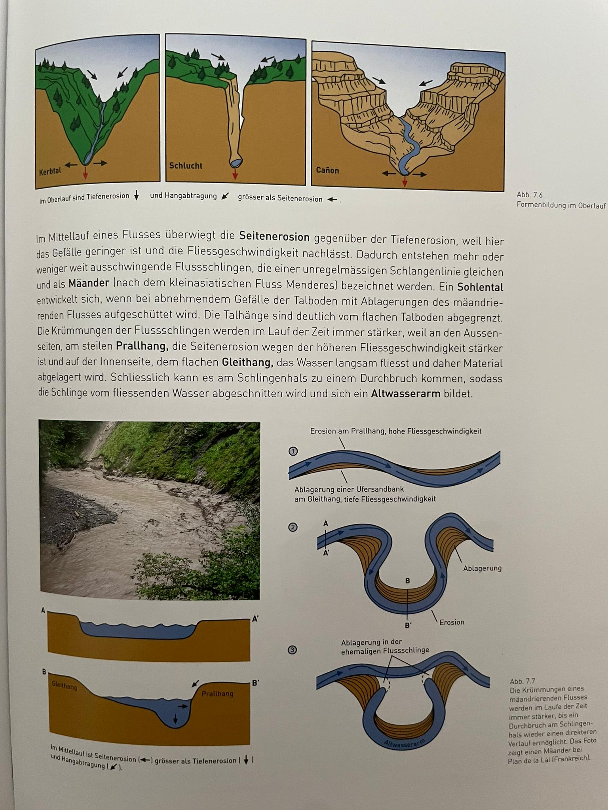
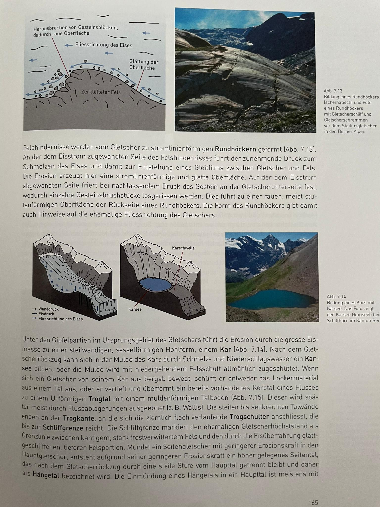
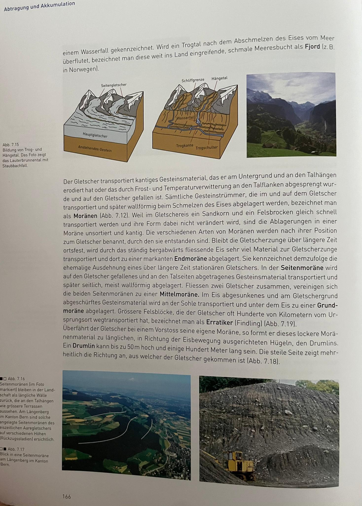
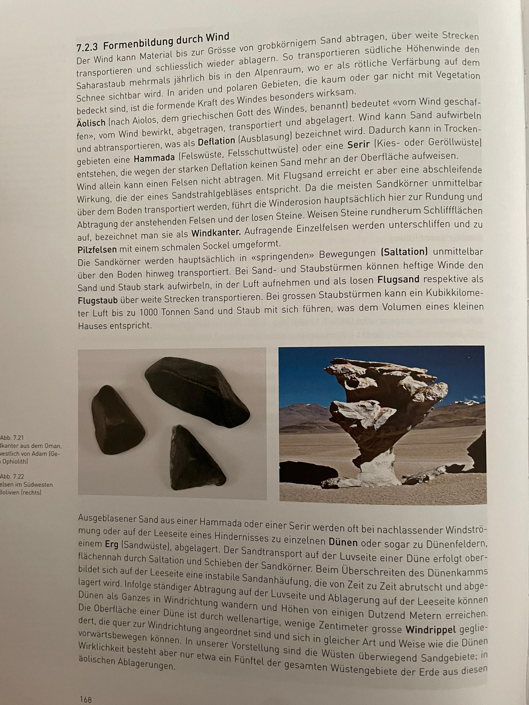
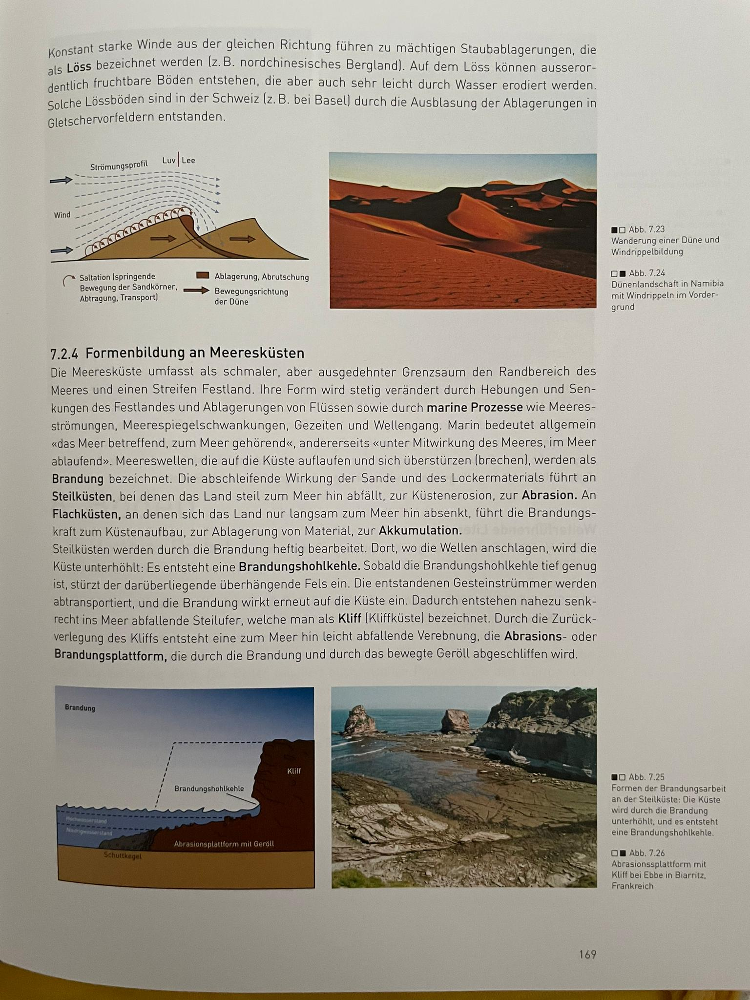
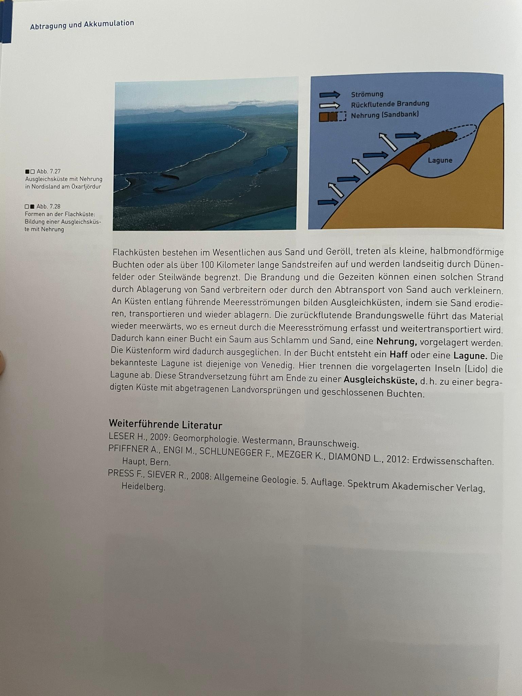

# Geomorphologie (S. 155-170)

**Geomorphologie** erklärt das aussehen der Landschaft durch **exogene** (_nicht_ vom Erdinneren) Kräfte.

## Verwitterung

**Verwitterung**: alle Prozesse, die Steine u. Mineralien zerstören

### Physikalische/Mechanische Verwitterung

Zerstört Steine _ohne_ chem. Veränderungen

* Temperaturverwitterung: Ausdehnen und Zusammenziehen durch Temp-Änderungen, führt zu Spannungen und Rissen. Vor allem bei mit unterschied. Mineralien
* Frostsprengung/Frostverwitterung: Wasser dringt ins Gestein ein und friert ein. Volumen von Wasser steigt an, es entsteht ein Druck, was zu Sprengungen führt.
* Salzsprengung: Mineralienhaltiges Wasser tritt in Stein ein, Wasser verdunstet und Mineralien kristallisieren unter mit Volumenzunahme, was den Stein sprengt
* Wurzelsprengung: Pflanzen wachsen in den Stein hinein und sprengen ihn.

### Chem. Verwitterung

Wasser und darin enthaltene Basen/Säuren lösen Steine auf. Kann mehrere hundert Meter tief stattfinden

* Hydrationsverwitterung: Wassermoleküle lagern sich ins Mineral hinein und schwächen es.
* Lösungsverwitterung: Steine lassen sich in Wasser lösen und werden so aufgelöst
* Karstverwitterung/Kohlensäureverwitterung: CO2 in der Luft wird bei Regen zu Kohlensäure und reagiert am Boden mit Kalkstein zu Calciumhydrogencarbonat. Der Kalkstein geht kaputt, es entstehen Karstfelder
* Rauchgasverwitterung: SO4 (von Mensch in die Luft gebracht) bildet Schwefelsäure, die Stein (z. B. Sandstein) chem. zersetzt.
* Oxidationsverwitterung: Sauerstoff reagiert mit dem Stein und lagert sich in die Mineralien ein. Dadurch ändert sich das Volumen, der Stein zerbricht.
* chem.-biolog. Verwitterung: Pflanzen u. Tiere scheiden Huminsäuren aus, die Steine angreifen

## Abtragung und Akkumulation

### Allgemein

* Abtragung entfernt/verlagert verwittertes Gestein vom Anstehungsort (z. B. durch Bergsturz, Steinschlag, Erosion, Abspülung, Wind (Deflation), oder Eis (Glazialerosion)).
* Erosion: Abtragung durch fliessendes Wasser (z. T. auch durch Wind, Eis u. Meer)
* Akkumulation: Dort wo das ganze dann landet

### Formenbildung durch Flüsse

* Fluvial: "vom Fluss geschaffen"
* Ober-, Mittel und Unterlauf: Flussabschnitte
* Tiefenerosion: Fluss erodiert nach unten
* Hangabtragung: Fluss erodiert auf die Seiten und nach unten
* Seitenerosion: Fluss erodiert auf die Seiten
* Flussformen
    * Wenn Tiefenerosion stark ist: Schlucht
    * Wenn Hangabtragung mit Tiefenerosion mithalten kann: Kerbtal
    * Wenn Tiefenerosion schwächer ist als Seitenerosion: Cañon
* Mäander: Schlagenförmiger Fluss
* Prallhang, Gleithang: Bei Kurven fliesst das Wasser auf der einen Seite schneller als auf der anderen, dadurch mehr Erosion, dadurch mehr Kurve: 
* Rückwärtserosion: Wasserfälle werden immer nach Hinten verschoben, da das Gestein erodiert
* Geröll- oder Geschiebefracht: Material rollt auf Flussboden mit
* Lösungsfracht: In Wasser gelöstes Material (z. B. Salz) wird transportiert
* Schotter: Ablagerungen im Fluss, meist sortiert. Kann ganze Talböden füllen, wenn Fluss zu viel ablagert
* Aue: Teil vom Talboden, der bei Hochwasser überflutet wird
* Flussterassen: Wenn Fluss in der Aue eine neue Aue bildet (durch Erosion), werden alte Auen zu Flussterassen
* Muldentäler: Im Unterlauf nimmt Flussgeschwindigkeit ab, es wird mehr abgelagert als erodiert, es bilden sich Muldentäler. Flüsse sind eher breit
* Delta: Wenn Fluss in See oder Meer mündet: Ablagerungen der Fracht setzen sich nieder: Fluss "wächst" ins Meer hinein. Schwere Fracht (z. B. Stein) setzt sich früher ab als leichtere (z. B. Ton)

### Formenbildung durch Gletscher

* Zwei Grundtypen von Eisbedeckung: Inlandeis (grosse Vereisung der Landmasse) und Gletscher (lokale Eisbedeckung)
* Ablation: Verdunstung/Abschmelzung von Gletschern
* Akkumulation: Neuschnee gibt Gletscher neues Material
* Gletscher bildet sich wenn Ablation kleiner ist als Neuschneemenge
* Neuschneekristalle werden zu grobkörnigem **Firn** komprimiert
* Unter Druck wird Firn zu **Eis**
* Nährgebiet: Wo Gletscher neues Material kriegt
* Eismasse wird so schwer, dass sie ins Tal fliesst
    * Einerseits durch Gleiten über den Boden
    * Anderseits durch Deformation der Eismasse
    * Im Extremfall mehrere Meter pro Tag
* Zehrgebiet: Ablation grösser als Akkumulation
* Gleichgewichtslinie: Trennt Nähr- und Zehrgebiet. Im Sommer sichtbar, dort wo Neuschnee nicht wegschmilzt ist der Gletscher heller
* Massenhaushalt: Differenz zw. Eiszuwachs und Eisverlust. Bestimmt ob Gletscher sich zurückzieht oder vorstösst
* Gletscherspalten: max. 20m breit, 60m tief
    * Querspalten: Wenn Hang steiler wird
    * Randspalten: Wenn Rand von Gletscher weniger schnell fliesst wegen Reibung
    * Längsspalten: Wenn Boden uneben ist
* Gletscherbäche: Bäche am Grund vom Gletscher
* Gletscherzunge: Ende vom Gletscher, Gletscherbäche kommen zum Vorschein in **Gletschertoren**
* Gletschermilch: Schmelzwasser von Gletscherbach (Farbe weil Fracht aus feinkörnigem Gestein wie Ton oder Silt besteht)
* Glazial: "Gletschereis und deren Einwirkungen", auch "Erscheinungen aus der Eiszeit"
* Wenn Gletscher sich zurückzieht gibt's neue Landschaft
* Gletscherschliff: Raue Erdoberfläche durch fliessendes Eis erodiert
* Gletscherschrammen: Furchen im Gestein, können Auskunft über ehemalige Fliessrichtung geben
* Rundhöcker: Geschliffene Felshindernisse, enthalten Schrammen. 
* Kar: Hohlform im Boden (eingedrückter Boden)
* Karsee: Wenn sich nach Gletscherrückzug in Kar ein See bildet
* Trogtal: Wenn Gletscher ein Kerbtal von einem Fluss weiter erodiert
* Kerbtal kann später durch Flussablagerungen wieder gefüllt werden
* Trogkante, Trogschulter, Schliffgrenze, Hängetal: 
* Schliffgrenze: Ehemaliger Höchststand eines Gletscher
* Fjord: Wenn Trogtal vom Meer geflutet wird
* Moräne: Gesteinstrümmer, die von Gletscher transportiert wurden und abgelagert sind. Sind unsortiert, da Sandkörner gleich schnell transportiert werden wie Felsbrocken
    * Endmoräne: Wenn Gletscherzunge länger am gleichen Ort bliebt, bildet sich dort eine Endmoräne
    * Seitenmoräne: Wird auf den Talseiten abgelagert
    * Mittelmoräne: Wenn zwei Gletscher zusammenfliessen, bilden zwei Seitenmoränen eine Mittelmoräne
    * Grundmoräne: Wenn Gesteinsmaterial im Gletscher absinkt und in der Sohle transportiert wird
    * Erratiker/Findling: Grosse Steinbrocken, die von Gletscher weit weg transportiert wurden
    * Drumling: Hügel (max 50m hoch, mehrere 100m lang), der entsteht wenn Gletscher seine eigen Moräne überfährt. Steilere Seite zeigt an, von wo der Gletscher kam.
* Glaziale Seenbildung
    * Karseen: Siehe oben
    * Zungenbeckenseen: Nach Rückzug von Gletscherzunge. Von Seitenmoränen umgeben
    * Toteisseen: Wenn beim Rückzug von Gletschern Eisbrocken in den Moränen zurückbleiben (sog. **Toteis**), sackt die Moräne später ein, wenn das Eis schmilzt. Es bildet sich ein See, der meist keine Zuflüsse hat.

### Formenbildung durch Wind

* Äolisch: "von Wind geschaffen"
* Deflation/Ausblasung: Wenn Wind Sand aufwirbelt und wegbringt
* Hammada: Felswüste, die entsteht, weil der Sand weggeblasen wurde
* Serir: Kies- oder Geröllwüste, ebenso entstanden wie Hammada
* Die Erosion durch sandhaltigen Wind findet knapp über dem Boden statt
* Windkanter: Steine, die durch sandhaltigen Wind rundum geschliffen wurden
* Pilzfelsen: Felsen, welche nur unten geschliffen wurden. 
* Saltation: Bewegung von Sandkörner, wenn sie sich "springend" fortbewegen
* Flugsand/Flugstaub: Sand, der vom Wind weite Strecken transportiert wird
* Dünen: Sandablagerungen, wenn der Wind nachlässt
* Erg: Sandwüste
* Luvseite von der Düne: "Vorderseite", dort wo der Wind weht
* Leeseite von der Düne: "Hinterseite", dort wo neues Material abgelagert wird
* Transport von Luv- zu Leeseite passiert durch Saltation
* Dünen können wandern, wenn der Wind ständig Material auf die windabgelegen Seite weht
* Windrippel: Auf der Oberfläche von Dünen, einige Zentimeter grosse Wellenformen. Quer zur Windrichtung
* Löss: Grosse fruchtbare, aber leicht erodierbare Staubablagerungen, wenn der Wind immer in die gleiche Richtung weht

### Formenbildung an Meeresküsten

* Marine Prozesse: Meeresströmung, Meeresspiegelschwankungen, Gezeiten u. Wellengang
* Marin: "Das Meer betreffend"
* Brandung: Welle, die auf die Küsten ausläuft
* Abrasion: Küstenerosion, entsteht durch schleifende Wirkung von Sand und Lockermaterial
* Küstenerosion findet v. a. bei Steilküsten statt
* Brandungshohlkehle: 
* Kliff: Sehr steiler Strand, entsteht wenn Brandungshohlkehle einstürzt
* Abrasions/Brandungsplattform: 
* Flachküsten: Bestehen aus Sand und Geröll, können wachsen (durch Akkumulation) oder schrumpfen
* Ausgleichsküste: Sand wird von Meeresströmungen erodiert, transportiert und an der gleichen Küste wieder abgelagert
* Nehrung: Ablagerung vor der Küste, wenn Brandung die Küste erodiert und es vor der Küste wieder Akkumuliert wird
* Lagune: 