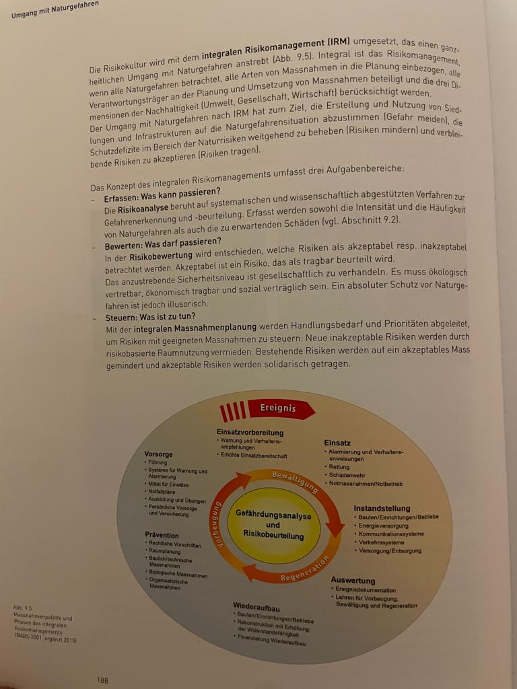
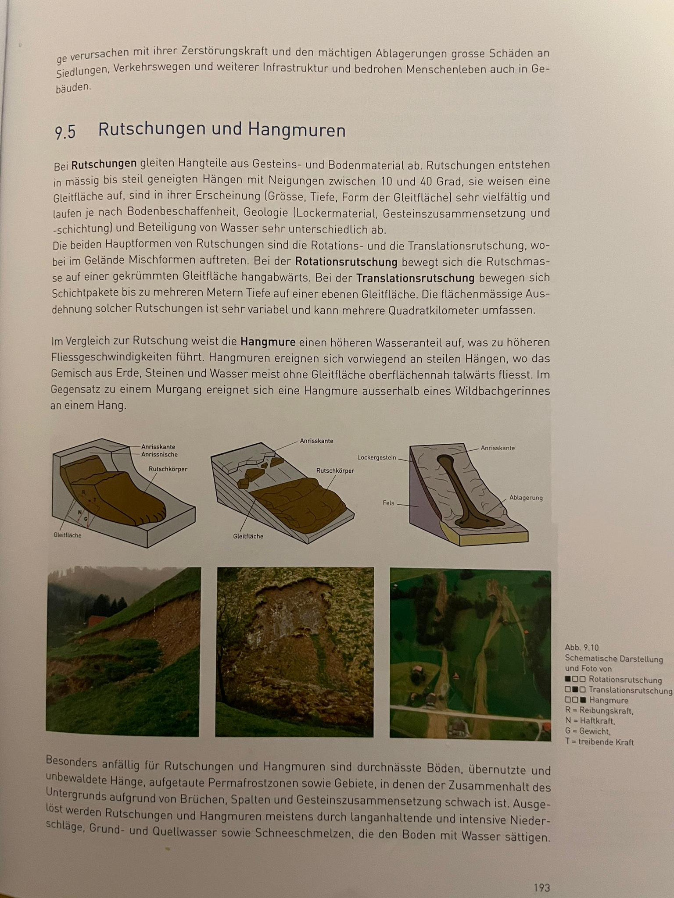
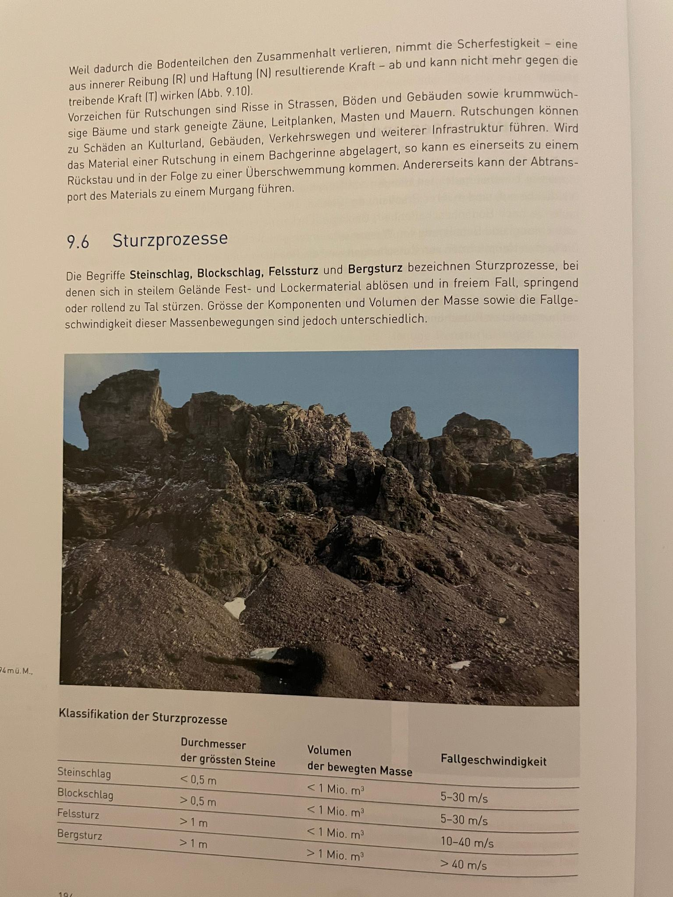
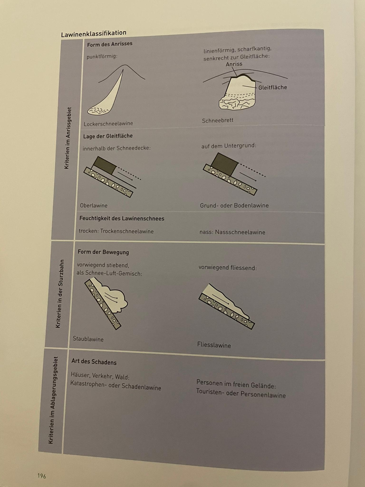

# Naturgefahren

## Umgang mit Naturgefahren

### Naturgefahren in der Schweiz

 * Gravitative Naturgefahren: Lawine, Murgang, Rutschungen, Hochwasser
 * Klimat.-meteorologische Naturgefahren: Trockenheit, Kältewellen, Stürme, Blitze
 * Tektonische Naturgefahren: Erdbeben, Vulkan

### Naturgefahr und Risiko

 * Naturgefahr: "Naturvorgänge, die schädlich sind für Menschen, Infrastruktur etc."
 * Gefahrenpotenzial: Intensität u. W'keit von allen Gefahren
 * Gefährdung: Eine spezifische Situation von Gefahr für ein Objekt (z. B. Gefahr für Infrastruktur in einem Dorf)
 * Schadenspotenzial: möglicher Schaden
 * Vulnerabilität: Schadenspotenzial für Personen
 * Risiko: Schadenspotenzial mal W'keit von Naturgefahren

### Integrales Risikomanagement im Umgang mit Naturgefahren

 * Gefahrenabwehr: (Bautechnische) Massnahmen gegen Gefahren
 * Risikokultur: Nicht dort bauen, wo es Gefahren hat (d. h. Schadenspotenzial minimieren)
 * integrales Risikomanagement (IRM)
    * Gefahren meiden, Risiken mindern und Restrisiko tragen. Integral weil es wirtschaftliche, gesellschaftliche und Umwelttechnische Aspekte beachtet.
    *    
    * Risikoanalyse: Erfassen von Gefahren
    * Risikobewertung: akzeptable vs. inakzeptable Risiken
    * IRM: Umsetzen von Massnahmen: **Ökologisch vertretbar, ökonomisch tragbar und sozial verträglich**

### Massnahmen (gegen Naturgefahren)

* planerische: Gut planen um Risiken zu vermeiden
* biologische: z. B. Vegetation anpflanzen, die bei Starkregen Wasser zurückhält
* Bautechnische: z. B. Steinschlagnetze
* organisatorische: Alarmierung u. Rettung, Vorhersagen von Naturgefahren

## Beurteilung einer Gefahrensituation

### Gefahrenerkennung

 * Naturereigniskataster: Katalog mit vergangen Ereignissen
 * Gefahrenhinweiskarte: Karte mit mögl. künftigen Ereignissen, ohne dessen Intensitäten oder W'keit zu beachten
 * Gefahrenbeurteilung mittels Gefahrenkarte (enthält Schadens- und Gefahrenpotenzial)

### Gefahrenerkennung und Gefahrenbeurteilung mit dem Dispositionsmodell

 * Disposition: Eigenschaft, die mit Eintreten von Naturgefahr zusammenhängt. Setzt sich aus Folgendem zusammen:
    * Grunddisposition (langzeitliche) : z. B. Relief, Geologie, Pflanzenbestand
    * variable Disposition: z. B. Wetterlage, Jahreszeit, Wasserhaushalt
    * auslösendes Ereignis: z. B. starker Regen

## Hochwasser

 * Hochwasser: Wenn ein bestimmter Schwellenwert erreicht ist
 * Überschwemmung: Wasser tritt über Ufer und bedeckt Landfläche
 * Temperaturanstieg: Gletscher/Schnee schmilzt, es gibt Schnee statt Regen (Wasser wird nicht gespeichert)
 * Bäche führen schneller Hochwasser als Flüsse
 * Guter Boden nimmt Wasser auf, sonst fliesst es ab und fördert Hochwasser (Vegetation ist wichtiger Faktor)
 * Topographie von Bach/Fluss wichtig: enger Bach führt schneller Hochwasser
 * Mensch zerstört Boden mit Strassen und Abholzungen
 * Renaturierung: Ein Gebiet wieder bepflanzen, um menschliche Aktivität rückgängig zu machen

## Murgang

 * Murgang: schnell fliessendes Gemenge aus Wasser und Feststoffen (30% - 60%). Bei Wildbächen
 * Ausgelöst durch:
    * $14^{\circ}$ Neigung
    * aufgetauter Permafrost
    * langer Regen
* Verklausung: Wenn es Feststeckt (z. B. bei Brücken)
* Übersarung: wenn Material bei Verklausung nach aussen gerät

## Rutschung/Hangmuren

 * Rutschung: Teil von Hang gleiten ab
 * 3 Typen: Rotationsrutschung, Translationsrutschung und Hangmuren
 *  

## Sturzprozesse

* Mehrere Typen (von klein nach gross sortiert): Steinschlag, Blockschlag, Felsschlag und Bergsturz (Definition: 
* Können durch Frostsprengungen ausgelöst werden
* Bei mehr als 30$^\circ$ Neigung
* Oftmals unangekündigt

## Lawinen

 * Neigung: 30$^\circ$ bis 50$^\circ$ (zu Steil geht nicht, Schnee lagert sich nicht ab)
 * Ausgelöst durch hohe Temperaturen oder Schneefälle
 * Mehrere Lawinentypen, Siehe 
 * Wenn Neigung plötzlich grösser wird, bildet sich eine **Staublawine**: sehr schnell
 * Nasslawine: Langsamer, eher fliessend

## Ausblick: Veränderung von Gefahr und Risiko
 * Schadenspotenzial nimmt zu wegen:
    * Klimawandel
    * Stärkere Bodennutzung
    * Teurere Bauten $\rightarrow$ grössere Schaden

### Klimawandel und Naturgefahren
 * Temperatur steigt in der CH
 * CH erwärmt sich stärker als der Durchschnitt
 * Niederschläge im Norden nehmen zu, im Süden ab
 * Schneefallgrenze steigt: Wasser wird direkt abfliessen $\rightarrow$ Hochwasser
 * Gletscher werden kleiner
 * Abflüsse nehmen im Winter zu, weil Wasser als Regen kommt anstatt Schnee
 * Permafrost schmilzt $\rightarrow$ Boden geht kaputt, könnte abrutschen
 * Waldgrenze wird nach oben verschoben: Grundsätzlich Gut, aber wächst der Wald schnell genug?
 * Gefahren nehmen zu: Hochwasser, Murgang, Rutschung, Sturzgefahren
 * Lawinengefahr nimmt aber nicht ab

### Siedlungsentwicklung und Risiko
 * Bei Neubauten wird klug gebaut, damit Risiko nicht steigt