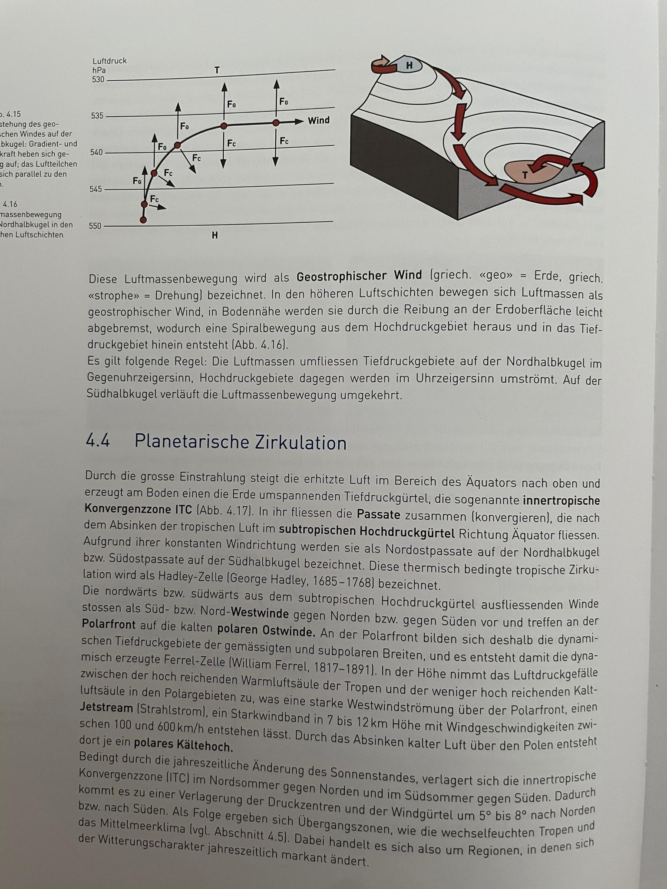

# Wetter und Klima (+Weltmeere) (S. 61-87, S. 103-108)

## Meteorologie und Klimatologie

Die **Meteorologie** beschäftigt sich mit dem aktuellen Zustand und Prozesse der Atmosphäre, um das Wetter vorherzusagen. Das **Klima** und die **Klimatologie** befassen sich mit der langfristigen Zustand der Atmosphäre, sogenannten **Klimaelementen**:

 * Strahlung
 * Temperatur
 * Luftdruck
 * Wind
 * Luftfeuchtigkeit
 * Verdunstung
 * Niederschlag und Bewölkung

Diese werden durch **Klimafaktoren** bestimmt. Sie sind abhängig von dem Ort:

 * geographische Breite
 * Lage zum Meer
 * Meeresströmungen
 * Relief
 * Höhenlage
 * Exposition
 * Vegetation

Regionen mit ähnlichem Klima werden in **Klimazonen** eingeteilt. Der Hauptunterschied zwischen Klima und Wetter ist, dass beim Klima auf langzeitliche Durchschnitte geachtet wird (d. h. es ändert sich nur langsam), während das Wetter von Tag zu Tag anders sein kann.

## Aufbau der Atmosphäre

Die **Atmosphäre** ist die Lufthülle der Erde. Sie hat folgende Schichten (von Unten nach Oben):

 * **Troposphäre** (0 - 8km bei den Polen, 18km beim Äquator): Das Wetter findet hier statt, Temperaturen bis zu $-55^{\circ}$. Pro 100m nimmt die Temperatur um $-0.65^{\circ}$ ab.
 * **Stratosphäre** (bis 50km):
Die Temperatur steigt wieder auf $+10^{\circ}$ an. Das Ozon befindet sich ebenfalls hier, es fängt UV-Strahlung ab.
 * **Mesosphäre** (bis 80km):
Die Temperatur nimmt erheblich ab, bis $-80^{\circ}$.
 * **Thermosphäre** oder **Ionosphäre** (bis 100km):
Die Temperatur steigt wieder an, da der Luftdruck hier erheblich tiefer ist. Hier kann ionisierende Strahlung O2 in O (Sauerstoff) spalten. **Sonnenwind** (Protonen und Elektronen, von der Sonne abgefeuert) folgt den magnetischen Feldlinien der Erde und brechen bei den Polen ein: Wenn sie auf Stickstoff treffen, leuchtet dieser auf: **Polarlichter**.
 * **Exosphäre** (ab 400km): Praktisch Weltraum

Der **Normaldruck** auf der Erdoberfläche beträgt 1013 Hektopascal (hPa). Dieser nimmt schnell ab und beträgt bei 50km nur noch 1 hPa.

## Klimaelemente und Klima allgemein

 * **Strahlung**: Sonne bestrahlt die Erde mit 1370W/m² (sog. **Solarkonstante**). Auf der Erdoberfläche kommen aber nur 341W/m² an, weil die Atmosphäre rund die Hälfte absorbiert. Die Strahlung wird auch reflektiert. Das **Albedo** (Wert zwischen 0 und 1) gibt an, wieviel reflektiert wird. Die Erdoberfläche selbst reflektiert die kurzwellige ankommende Strahlung als langwellige zurück. Die langwellige Strahlung trifft auf dem Weg zum Weltall aber erneut auf die Atmosphäre, wo dann ein Teil abermals absorbiert wird. Auch durch die Verdunstung von Wasser auf der Erdoberfläche gelangt Wärme in die Atmosphäre.
 * **Lufttemperatur**: Wird 2m über Boden an schattigen und gut durchlüfteten Orten gemessen. Sie ist von Folgenden Faktoren abhängig:

    1. Strahlung (Geographische Breite, Jahreszeit, Tageszeit)
    2. Erdoberfläche (Höhe, Exposition, Kontinentalität, Meeresströmungen)
	3. Zirkulation (Luftmassen, Bewölkung)

    **Inversion**: Wenn die Luft am Boden kühler ist als die darüberliegende. Dadurch wird die Luft nicht vermischt, Schadstoffe sammeln sich an.

 * **Luftfeuchtigkeit**:
    Die Luftfeuchtigkeit sagt, wieviel Wasser die Luft aufnehmen kann. Die **absolute** Luftfeuchtigkeit misst, wieviel g/m³ Wasser es in der Luft hat. Die Luft kann nur endlich viel Wasser aufnehmen. Die maximale Menge wird als **Sättigungsmenge** bezeichnet und ist von der Temperatur abhängig. Der **Taupunkt** bezeichnet, auf welche Temperatur die Luft abgekühlt werden muss, damit das Wasser zu kondensieren beginnt. Die **relative Luftfeuchtigkeit** gibt an, wieviel Wasser die Luft aufgenommen hat relativ zu der momentanen maximalen Menge.

    Wenn die Luft aufsteigt, kühlt sie sich um $1^{\circ}$ pro 100m ab (**trockenadiabatischer Temperaturgradient**), bis der Taupunkt erreicht ist. Dann kühlt sie sich nur noch um $0.65^{\circ}$ pro 100m ab (**feuchtadiabatischer Temperaturgradient**).

    Wenn die Luft den Taupunkt unterschreitet, kondensiert das Wasser: Es bilden sich **Kondensationskristalle** um kleine Staubkörner in der Luft. Diese können bis 0.01 mm gross sein und bleiben so in der Luft. Es wird als Nebel bezeichnet, wenn die Sicht deswegen auf unter 1000m Eingeschränkt wird.

 * **Wolken**: Es werden folgende zwei Haupttypen unterschieden:
    1. Cumulus: Haufenwolken, entstehen wegen der **Konvektion** (aufsteigen warmer Luft in kälterer Umgebung)
    2. Stratus: Schichtwolken, entstehen wegen **Advektion** (aufgleiten warmer Luft auf kälterer)

    

 * **Niederschlag**:
Folgende Niederschlagsarten sind möglich:
Regen, Nieselregen, Starkregen, Schnee, Graupel, Hagel, Tau, Reif

 * **Luftdruck und Winde**:
   Der Luftdruck halbiert sich pro 5.5km Höhenmeter. Er wird auf Karten mit Hilfe von **Isobaren** dargestellt. Gebiete mit hohen Druck sind **Antizyklone**, solche mit tiefem sog. **Zyklone**. Durch temperaturbedingte Druckunterschiede entsteht **Zirkulation** oder **Wind**: Erwärmte Luft steigt auf und bildet ein Bodentief, kalte Luft sinkt ab und bildet ein Bodenhoch.
   
    Die **Gradientkraft** ist die Kraft, die der Druckunterschied ausübt.
    Die **Corioliskraft** ist die Kraft, die auf Luftmassen wirkt, wenn sie sich senkrecht zum Äquator bewegen. Winde zu dem Äquator werden nach Westen abgelenkt, Winde vom Äquator werden nach Osten abgelenkt.

    **Geostrophischer Wind** entsteht, wenn Luft vom Hochdruckgebiet ins Tiefdruckgebiet geht. Bei der Nordhalbkugel dreht sich der Wind um das Tiefdruckgebiet gegen den Uhrzeigersinn, bei Hochdruckgebieten im Uhrzeigersinn. Bei der Südhalbkugel umgekehrt.

 * **Planetarische Zirkulation**: Die **innertropische Konvergenzzone (ITC)** ist ein Tiefdruckgebiet beim Äquator. Es entsteht, weil die warme Luft dort aufsteigt. Wegen dem Tief entstehen sog. **Passatwinde**, die von den **Subtropen** in die Tropen wehen. In den Subtropen entsteht also ein Hochdruckgebiet, und von dort strömt auch Luft zu den Polen hin. Es entstehen sog. **Jetstreams**. Da die Luft von Oben zu den Polen kommt und dort abkühlt und niedersinkt, entstehen dort auch Hochs.

 * **Klimazonen**:
    Mithilfe von **Klimadiagrammen** (mit Temperatur- und Niederschlagsdaten) kann man Klimas klassifizieren folgende Klimazonen klassifizieren. Sie sind kommen in der Regel nur in gewissen geographischen Breiten vor:
    1. Kalte Zone (Eisregion, Tundra, Taiga)
    
    2. Gemässigte Zone (Laubwälder, Mischwälder, Winterkalte Steppen, Winterkalte Wüste)
    
    3. Subtropenzone (Immergrüne Hartlaubgewächse)
    
    4. Tropen (Tropische Wüste, Dornsavanne etc.)
    
       

  Es werden auch folgende Höhenstufen unterschieden: Kolline, Montane, Subalpine, Alpine, Subnivale und Nivale Höhenstufen.

 * **Polarfront und Jetstream**:
    

  

* **Föhn**
Entsteht wenn Luft über einen Berg geht und Luftfeuchtigkeit verliert, siehe Bild 

## Klimawandel

### Klimaschwankungen und Klimawandel

* Klimaschwankung: Schwankungen unter einer bestimmten Bandbreite
* Klimaveränderung: Wenn beim Mittelwert ein Trend zu erkennen ist
* Klimawandel: Wenn Klimaveränderung langfristig ist
* Interpretation ist abhängig von gewählter Bandbreite für Abweichungen

### Natürliche und anthropogene Einflüsse

* Natürliche Treibhauseffekte: Natürliche Einflüsse, z. B. Schwankung der Sonnenaktivität, Erdumlaufbahnänderungen, Atmosphärenänderung (z. B. Vulkanausbruch)
* Anthropogene Treibhauseffekte: Menschliche Einflüsse, ca. seit 1850, seit 1980 intensiver

### Auswirkungen der Klimaveränderung

* Ursachen: Waldrohdung, fossile Energie -> CO2, Methan
* (anthropogener) Treibhauseffekt: Markanter Temperaturanstieg in Bodennaher Luftschicht
* Schweiz: $1.0^{\circ}$C über Mittel des 20. Jahrhunderts
* Auswirkungen des globalen Temperaturanstiegs
    * Verschiebung der Klimazonen, Veränderung von Ökosystemen
    * Meeresspiegel steigt an, Versauerung der Meere, Meeresströmungen
    * Gletscher/Pole schmelzen
    * Mehr Naturkatastrophen
    * Weniger Artenvielfalt

## Luft- und Strahlenbelastung

* Smog: "smoke" + "fog", wenn es eine hohe Konzentration von Luftschadstoffen wie O3, CO, NO, NO2 und Staubpartikel in der Luft hat. Gesundheitsgefährdend und reizend

### Wintersmog

* Winter führt zu Hochdrucklage, die Inversion (Warme Luft oben, kalte Unten) auslöst. Dadurch wird weniger Luft zw. Luftschichten ausgetauscht, Schadstoffe sammeln sich
* PM10: Feinstaub, kleiner als 10 Tausendstelmillimeter. Gibt Krebs
* Waldsterben: Wegen saurem Regen, ausgelöst durch Schwefelsäure in der Luft

### Sommersmog

* Sommersmog: Ausgelöst durch Ozon (O3). Ozon wird gebildet, wenn Stickoxide oder VOC ("volatile organic compunds", flüchte Kohlenwasserstoffe) in der Luft sind

### Grenzwerte (CH)

* Ozon: $120\;\mu g/m^3$
* Feinstaub: $50\;\mu g/m^3$
* Schwefeldioxid: $100\;\mu g/m^3$

### Ultraviolettstrahlung

* Ozon ist in der Stratosphäre wichtig, wird dort aber wegen Mensch weniger
* Ozon fängt böse Strahlung ab
* Ozon wurde früher durch FCKW zerstört.
* FCKW lösen Ozonlöcher aus, erstmals 1981 aufgefallen
* Wenn UV-Strahlung auf Haut kommt gibt es Krebs oder Immunerkrankung oder etc. Photosynthese von Pflanzen wird gestört, Phytoplankton nimmt ab

## Gewässer

### Stehende Oberflächengewässer

* Eutrophierung: See ist mit anorganischen Nährstoffen überlastet. Verändert Ökosystem
* Epilimnion: Oberste Seeschicht, Wärme homogen verteilt weil von Wind umgewälzt
* Metalimnion: Temperatur nimmt stark ab
* Hypolimnion: Unterste kalte Schicht
* Zuflüsse haben Einfluss auf Strömungen im See

### Weltmeere

#### Meeresströmungen

 * Ozeane sind wichtige Klimafaktoren
 * Meeresströmungen sind Energietransporter zw. den geograph. Breiten
 * Driftströmung: Wind verursacht Strömungen (z. B. Randtropen)
 * Gradientströmungen: Verursacht durch Dichteunterschiede wegen Wärme oder Salzgehalt im Wasser
 * Kaltes Wasser an den Polen sinkt ab und fliesst in die Richtung des Äquators. Driftströmungen an der Oberfläche Winden das Wasser zu den Polen
 * Corioliskraft wirkt auch bei Strömungen
 * Meeresströmungen folgen den Winden, werden aber von Landmassen abgelenkt
 * Wenn kalter Strom vor Küste ist, wird die Luft dort kühl. Wärmt sich diese dann über Land auf, sinkt die rel. Luftfeuchtigkeit. Es können Wüsten entstehen (Bsp. Humboldt-Strom und Chile, sonstige Küstenwüsten)
 * Warme Ströme gehen vom Äquator weg (z. B. Golfstrom)
 * 

#### Golfstrom

 * Passatwinde bewegen Golfstrom von Mexiko zu Europa. Europa ist dadurch wärmer und feuchter als es unter normalen Umständen wäre
 * Atlantik ist salzhaltiger als andere Ozeane, weil höhere Verdunstung
 * Wegen Klimaerwärmung: Pole werden wärmer, Golfstrom könnte ausbleiben, wenn kein kaltes Wasser am Nordpol absinkt, was dann kein warmes Wasser aus dem Golf nachzieht
 * Könnte auch sein, dass Golfstrom stärker wird weil der Atlantik noch salzhaltiger wird, was zu mehr Wassermassentransport führt

#### El Niño

 * 

#### Meeresspiegelveränderungen als Folge von Klimaschwankungen

 * Polen schmelzen --> Meeresspiegel steigt an
 * Wasser dehnt sich aus wenn es wärmer ist --> Meeresspiegel steigt an
 * Wenn Meeresspiegel stark steigt: 45-82cm Steigerung
 * Wenn gering steigt: 26-55cm
 * Beim Anstieg können Küsten überflutet werden
 * Viele Menschen leben an Meeresküsten, viele sind betroffen