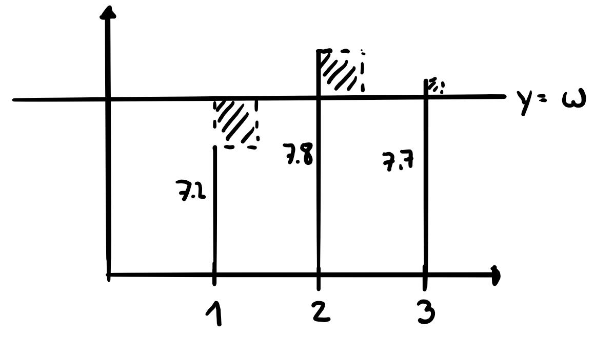

# HP, TP, WP und Extremalprobleme

## Begriffe

### Links / Rechts Kurve

$$\begin{align}
  y''&>0\;\textrm{(links)}\\
  y''&<0\;\textrm{(rechts)}
\end{align}$$

### Tiefpunkt TP

$$\begin{align}
  y'&=0\\
  y''&>0
\end{align}$$

### Hochpunkt HP

$$\begin{align}
  y'&=0\\
  y''&<0
\end{align}$$

### Wendepunkt WP

$$y''=0$$

### Sattelpunkt SP

$$\begin{align}
  y'&=0\\
  y''&=0
\end{align}$$

## Aufbau Kurvendiskussion

1.  $y'$ und $y''$ bestimmen
2.  Nullstellen
3.  HP/TP
4.  WP
5.  Grenzen ($\lim_{x\to\pm\infty}y$)
6.  Graph

## Extremalprobleme

1.  Formel für den zu minimierenden / maximierenden Parameter aufstellen
2.  Beziehungen zwischen Variablen der Formel finden (z. B. mit Hilfe von Strahlensätzen)
3.  Formel aus 1 mit Hilfe der Beziehung nach einer Variablen umschreiben
4.  Mit Hilfe von Ableiten HP und TP finden

## Trick Extremalstellen

Alle veränderte Funktionen (z. B. $y^2$) von $y$ haben Extremalpunkte an derselben Stelle. Nützlich um z. B. $y=x\sqrt{1-2x}$ abzuleiten.

## Methode der kleinsten Quadrate

$w$ so bestimmen, dass die Summe der quadrierten Differenzen $\sum_{n=1}^{p}d_n^2$ einer Anzahl $p$ an Punkten mit Werten $z$ minimiert wird $s(w)$:

$$\begin{align}
  s(w)&=\sum_{n=1}^{p}d_n^2\\
  s(w)&=\sum_{n=1}^{p}(w-z_n)^2\\
  s(w)&=\sum_{n=1}^{p}(w^2-2w\cdot z_n + z_n^2)\\
  s'(w)&=\sum_{n=1}^{p}(2w-2z_n)\\
  0&=\sum_{n=1}^{p}2*(w-z_n)\\
  0&=\sum_{n=1}^{p}(w-z_n)\\
  0&=p\cdot w - \sum_{n=1}^{p}z_n\\
  w&=\frac{\sum_{n=1}^{p}z_n}{p}
\end{align}$$