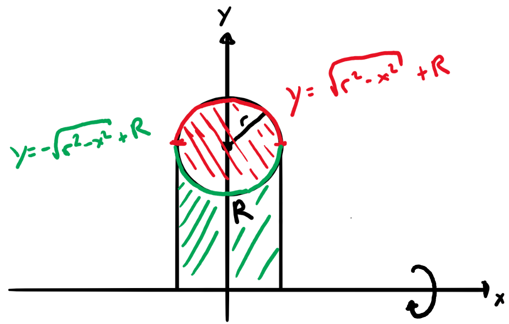
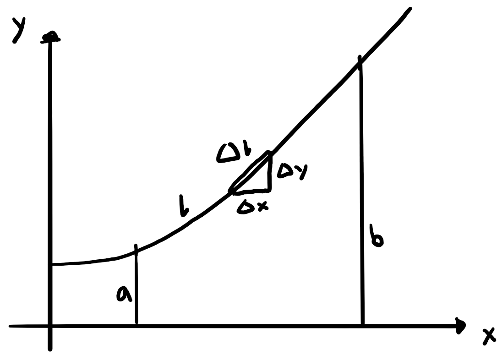
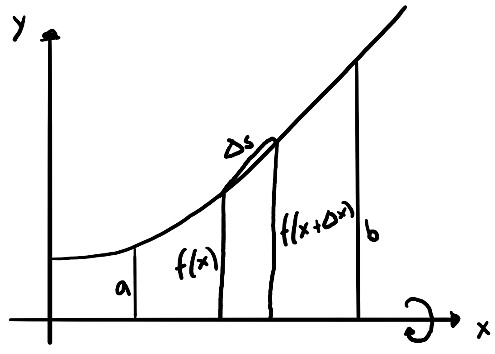

# Integralrechnung I

## Streifenmethode

Ausführliches Berechnen von Flächen unter Funktionen.

### Vorbemerkung: Wichtige Formeln:

1.  $$\sum_{k=1}^{n}k=\frac{n(n+1)}{2}$$
2.  $$\sum_{k=1}^{n}k^2=\frac{n(n+1)(2n+1)}{6}$$
3.  $$\sum_{k=1}^{n}k^3=\frac{n^2(n+1)^2}{4}$$

### Grundidee

Die zu bestimmende Fläche (von z. B. 0 bis $b$) soll in $n$ Streifen mit Breite $\frac{b}{n}$, die einmal grösser (Obere Grenze mit Fläche $O_n$) und einmal kleiner (Untere Grenze mit Fläche $U_n$). Die tatsächliche Fläche $A$ liegt dazwischen. Es gilt also $U_n\leq A\leq O_n$. Wenn $n$ zu $\infty$ wächst, wird der Unterschied zwischen $U_n$ und $O_n$ immer kleiner, sodass $A$ nun einen konkreten Wert bekommt: $\lim_{n\to\infty}U_n=A=\lim_{n\to\infty}O_n$

Alternativ kann man auch nur mit einer Grenze (z. B. $O_n$) und dann einfach $A=\lim_{n\to\infty}O_n$ sagen:

1.  $$\frac{b}{n}=\Delta x$$
2.  $$O_n=\sum_{i=1}^{n}f(x_i)\Delta x$$
3.  $$A=\lim_{n\to\infty}O_n$$

### Beispiel

$f(x)=\frac{1}{2}x^2-3x$

$$\begin{align}
  O_n&=\sum_{i=1}^{n}\frac{b}{n}\left[\frac{1}{2}\left(\frac{i\cdot b}{n}\right)^2-3\left(\frac{i\cdot b}{n}\right)\right]\\
  &=\frac{1}{2}\left(\frac{b}{n}\right)^3\left[\sum_{i=1}^{n}i^2\right]-3\left(\frac{b}{n}\right)^2\left[\sum_{i=1}^{n}i\right]\\
  &=\frac{b^3n(n+1)(2n+1)}{12n^3}-\frac{3b^2n(n+1)}{2n^2}\\
  &=\frac{b^3\cancel{n^3}(1+\frac{1}{n})(2+\frac{1}{n})}{12\cancel{n^3}}-\frac{3b^2\cancel{n^2}(1+\frac{1}{n})}{2\cancel{n^2}}\\
  \lim_{n\to\infty}O_n&=\frac{1}{6}b^3-\frac{3}{2}b^2
\end{align}$$

## Integralschreibweise

Für Flächen $I(b)$ unter einem Abschnitt 0 bis $b$ schreibt man:

$$I(b)=\int_{0}^{b}f(x)\,dx$$

## Hauptsatz der Analysis

Beweis mit Differenzenquotienten $\frac{\Delta I}{\Delta x}$ mit $I(x)$ als Fläche / Integral (ähnlich zur Definition der Ableitung)

$$\begin{align}
  \Delta xf(x+\Delta x)&\leq\Delta I\leq\Delta xf(x)\\
  f(x+\Delta x)&\leq\frac{\Delta I}{\Delta x}\leq f(x)\\
  \lim_{\Delta x\to 0}f(x+\Delta x)&\leq\lim_{\Delta x\to 0}\frac{\Delta I}{\Delta x}\leq\lim_{\Delta x\to 0}f(x)\\
  f(x)&\leq I'(x)\leq f(x)
\end{align}$$

Die Integralfunktion $I(x)$ abgeleitet gibt die Funktion $f(x)$:

$$I'(x)=f(x)$$

## Bestimmte Integrale

$F(x)$ mit $F'(x)=f(x)$ nennt man die Stammfunktion von $f(x)$. Für bestimmte Integrale im Bereich von $a$ bis $b$ gilt:

$$\int_{a}^{b}f(x)\,dx=F(b)-F(a)$$

Theoretisch entsteht beim Integrieren immer noch eine Konstante $C$, die allerdings bei bestimmten Integralen wegfällt bzw. sich selbst wegsubtrahiert. 

## Integralsätze

1.  $$\int_{a}^{b}cf(x)\,dx=c\int_{a}^{b}f(x)\,dx$$
2.  $$\int_{a}^{b}f(x)\,dx=-\int_{b}^{a}f(x)\,dx$$
3.  $$\int_{a}^{b}f(x)\,dx=\int_{a}^{c}f(x)\,dx + \int_{c}^{b}f(x)\,dx$$
4.  $$\int_{a}^{b}f(x)\pm g(x)\,dx=\int_{a}^{b}f(x)\,dx \pm \int_{a}^{b}g(x)\,dx$$

## Flächen bei Integralen

Integrale sind nur über der x-Achse tatsächliche Flächen. Darunter wird das Integral negativ und der Betrag muss genommen werden. Vor allem ist auf Nullstellen zwischen $a$ und $b$ zu achten. Dort müssen die Integrale zwischen den Nullstellen separat ausgerechnet werden.

Dieses Problem fällt weg, sobald die Fläche zwischen zwei Funktionen $f(x)$ und $g(x)$
berechnet werden muss. Idee dahinter ist die Verschiebung beider Funktionen um ein $C$, welches sie im Raum von $a$ und $b$ oberhalb der x-Achse verschiebt. Dieses $C$ fällt anschliessend weg und es gilt:

$$A=\int_{a}^{b}f(x)-g(x)\,dx$$

Selbst die Reihenfolge  von $f(x)$ und $g(x)$ ist unwichtig.

## Uneigentliche Integrale

Uneigentliche Integrale sind Integrale, bei denen unendlich lange Flächen mit je nachdem endlichen Flächeninhalt berechnet werden. Folgende Vorgehensweise wird verwendet:

$$\begin{align}
  \int_{a}^{\infty}f(x)\,dx&=\lim_{b\to\infty}\int_{a}^{b}f(x)\,dx\\
  &=\lim_{b\to\infty}\left.F(x)\right|_a^b\\
  &=\lim_{b\to\infty}F(b)-F(a)
\end{align}$$

## Rotationsvolumen V einer Funktion f(x)

### Herleitung

Beweis mit Hilfe mit Zylinderscheiben statt den Streifen:

$$\begin{align}
  V&=\lim_{n\to\infty}\sum_{k=1}^{n}V_k\\
  &=\lim_{n\to\infty}\sum_{k=1}^{n}\pi f^2(x)\Delta x\\
  &=\int_a^b \pi f^2(x)\,dx\\
  &=\pi \int_a^b f^2(x)\,dx
\end{align}$$

### Volumen V eines Torus ("Donut")

Ein Kreis mit Radius $r$ und Abstand $R$ zur x-Achse rotiert um diese.

$$\begin{align}
  V&=2\pi\int_0^r (\sqrt{r^2-x^2}+R)^2\,dx-2\pi\int_0^r (-\sqrt{r^2-x^2}+R)^2\,dx\\
  &=2\pi\int_0^r (K+R)^2-(-K+R)^2\,dx\\
  &=2\pi\int_0^r 4KR\,dx\\
  &=8\pi R\int_0^r \sqrt{r^2-x^2}\,dx\\
  &=2\pi^2r^2R
\end{align}$$

## Länge l einer Kurve

Idee mit $n$ Dreiecken.

$$\begin{align}
  l&=\lim_{\Delta x\to 0}\sum_{i}\sqrt{\Delta x^2+\Delta y^2}\\
  &=\lim_{\Delta x\to 0}\sum_{i}\sqrt{\Delta x^2\left(1+\left(\frac{\Delta y}{\Delta x}\right)^2\right)}\\
  &=\lim_{\Delta x\to 0}\sum_{i}\sqrt{1+\left(\frac{\Delta y}{\Delta x}\right)^2}\Delta x\\
  &=\int_a^b \sqrt{1+(y')^2}\,dx
\end{align}$$

## Mantelfläche M eines Rotationskörpers

Idee mit Mantelfläche $M=\pi(r_1+r_2)s$ der Zylinderscheiben mit Dicke $s$:

$$\begin{align}
  M&=\lim_{\Delta x\to 0}\sum_i \pi(f(x)+f(x+\Delta x))\Delta s\\
  &=\lim_{\Delta x\to 0}\pi\sum_i (f(x)+f(x+\Delta x))\sqrt{1+\left(\frac{\Delta y}{\Delta x}\right)^2}\Delta x\\
  &=2\pi\int_a^b y\sqrt{1+(y')^2}\,dx
\end{align}$$

