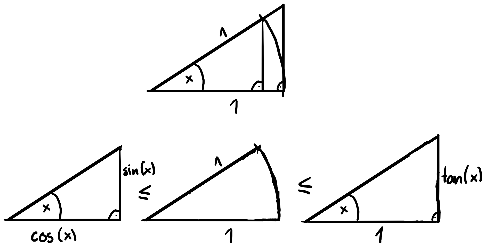

# Repetition Funktionen und Ergänzungen

## Funktionen vs. Relationen

Funktionen sind eindeutige Zuordnungen aller $x\in\mathbb{D}$ zu jeweiligen $y\in\mathbb{W}$. Wenn dies sogar umgekehrt gilt, dann sind auch Umkehrfunktionen $f^{-1}$ mit $f^{-1}(f(x))=\;\forall x\in\mathbb{D}$. Umkehrfunktionen können in diesem Fall mit Umtauschen von $x$ und $y$ erreicht werden.

Relationen sind bedingungslose Beziehungen zwischen $y$ und $x$. Beispiel hierfür sind Kreise und Ellipsen mit $(\frac{x}{a})^2+(\frac{y}{b})^2=1$.

## Spezielle Punkte

### x-Achse / Nullstelle

$$(f(x)=0|0)$$

### y-Achse

$$(0|f(0))$$

### Schnittpunkte

$$f(x)=g(x)$$

## Spezielle Funktionen

### Geraden

Geraden haben eine Steigung $m$ und einen y-Achsenabschnitt $q$:

$$y=mx+q$$

### Parabeln

#### Quadratische Funktion

Quadratische Funktionen haben 2 typische Schreibweisen:

Erste Art

$$y=ax^2+bx+c$$

Zweite Art (mit (u|v) als Scheitelpunkt)

$$y=a(x-u)^2+v$$

#### Weitere Parabeln / Hyperbeln

Funktionen mit $y=x^k$ und $k>1$ sind parabelförmig, wobei bei negativen $k$ Hyperbeln entstehen. Bei beiden streben gerade $k$ sowohl für negative als auch positive $x$ zu $\infty$. Bei ungeraden gehen die negativen Richtung $-\infty$.

#### Symmetrien

Parabeln sind achsensymmetrisch ($f(-x)=f(x)\forall x$), wenn die Funktion nur gerade Exponenten besitzt, sie also wie folgt aufgeschrieben werden kann:

$$\sum_{k=0}^{n}a_k\cdot x^{2k}$$

Parabeln sind punktsymmetrisch ($f(-x)=-f(x)\forall x$), wenn die Funktion nur ungerade Exponenten besitzt, sie also wie folgt aufgeschrieben werden kann:

$$\sum_{k=0}^{n}a_k\cdot x^{2k+1}$$

### Sinus / Cosinus / e / ln

Sowohl $\sin$ als auch $\cos$ besitzen $\mathbb{D}=\mathbb{R}$ und $\mathbb{W}=[-1;1]$ mit den jeweiligen Umkehrfunktionen $\sin^{-1}=\arcsin$ und $\cos^{-1}=\arccos$.

$e^x$ hat $\mathbb{D}=\mathbb{R}$ und $\mathbb{W}=\mathbb{R}^+$. Die Umkehrfunktion ist der $\ln$.

## Funktionen bestimmen

Die einfachste Funktion die durch $n$ Punkte gegeben ist, ist eine ($n-1$)-ten Grades und kann also durch ein Gleichungssystem mit $n$ Gleichungen bestimmt werden.

## Stetigkeit / Differenzierbarkeit

### Stetigkeit

Funktionen sind stetig, wenn ihr Graph ohne absetzen gezeichnet werden kann bzw.:

$$\lim_{x\to a^-}=\lim_{x\to a^+}=f(a)\;\textrm{oder}\;\lim_{x\to a}f(x)=f(a)$$

### Differenzierbarkeit

Funktionen sind differenzierbar, wenn sie keinen Knick besitzen. Beispiel für nicht differenzierbare Funktionen wären $y=|x^2-4|$ oder $y=\begin{cases}-2x+1 &x<2\\ x+a &x\geq2\end{cases}$

## Neue Grenzwerte

$\lim_{x\to 0}\frac{\sin(x)}{x}$ (Mit Hilfe der Fläche von Dreiecken und Kreissektoren)

$$\begin{align}
  \frac{\sin(x)\cos(x)}{2}&\leq\frac{x\cdot 1}{2}\leq\frac{\tan(x)\cdot 1}{2}\\
  \sin(x)\cos(x)&\leq x\leq\frac{\sin(x)}{\cos(x)}\\
  \cos(x)&\leq \frac{x}{\sin(x)}\leq\frac{1}{\cos(x)}\\
  1&\leq \lim_{x\to 0}\frac{x}{\sin(x)}\leq 1\\
  &\Rightarrow\lim_{x\to 0}\frac{\sin(x)}{x}=1
\end{align}$$

$\lim_{x\to 0}\frac{\cos(x)-1}{x}$

$$\begin{align}
  \lim_{x\to 0}\frac{\cos(x)-1}{x}&=\lim_{z\to 0}\frac{\cos(2z)-1}{2z}\\
  &=\lim_{z\to 0}\frac{1-2\sin^2(z)-1}{2z}\\
  &=\lim_{z\to 0}\frac{-2\sin^2(z)}{2z}\\
  &=\lim_{z\to 0}\frac{\sin(z)}{z}\cdot\sin(z)\\
  &=0
\end{align}$$

Alternativ mit De L'Hospital siehe [Differentialrechnung II](./diff2.md)

