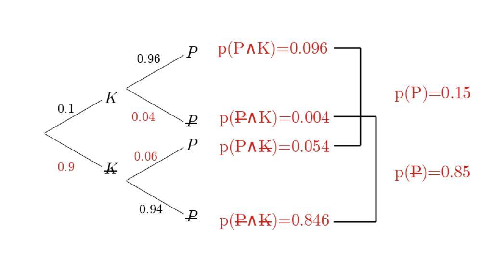
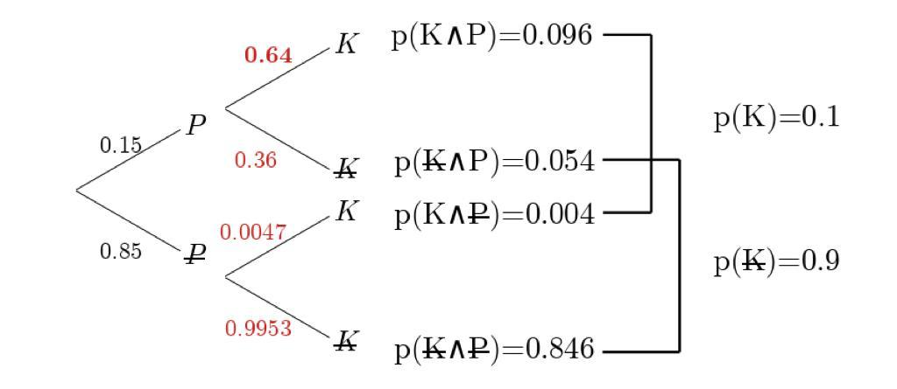

# Wahrscheinlichkeitsrechnung

Bemerkung: Die meisten Aufgaben können auch mit Baumdiagrammen, statt klassischer Kombinatorik gelöst werden.

## Begriffe / Schreibkonventionen

### Ereignis

Ereignisse werden als $E$ aufgeschrieben. Die Anzahl Elemente $k$ in $E$ sind $|E|$.

### Wahrscheinlichkeit

Wahrscheinlichkeit eines Ereignisses E: $p(E)$

### Ergebnisraum

Alle möglichen Ergebnisse: $\Omega$. Die Anzahl Elemente $n$ in $\Omega$ sind $|\Omega|$

### Elementarereignisse

Einziges Element des Ergebnisraumes: $\omega$

### Gegenereignis

Das Gegenereignis von $E$ heisst $\bar{E}$ ("E quer"). Es hat den Wert $\bar{E}=1-E$

## Laplace-Wahrscheinlichkeit

Wenn alle Elementarereignisse $\omega$ die gleiche Wahrscheinlichkeit haben, gilt:

$$p(E)=\frac{|E|}{|\Omega|}=\frac{k}{n}$$

## Bedingte Wahrscheinlichkeiten

### Allgemein

Ein Ergebnis kann unter einer bestimmten Bedingung auftauchen (Beim Baum hängt das unterste Ereignis von den oben angesetzten Bedingungen ab). Man schreibt für die Wahrscheinlichkeit: $p(E|Bedingung)$ oder allgemein: $p(A|B)$. Die Wahrscheinlichkeit, dass sowohl $A$ als auch $B$ eintreten wird $p(A\wedge B)$ oder in der Mengenlehre $A\cap B$ aufgeschrieben. Sie entspricht also der Multiplikation der Zahlen eines Astes beim Baum oder:

$$\begin{align}
  p(A\wedge B) &= p(A|B)\cdot p(B)\\
  p(A|B)&=\frac{p(A\wedge B)}{p(B)}
\end{align}$$

Für die umgekehrte Bedingung $p(B|A)$ können wir (klarer mit Mengenlehre) Folgendes genau so gut schreiben:

$$p(B|A)=\frac{p(A\wedge B)}{p(A)} = \frac{p(A|B)\cdot p(B)}{p(A)}$$

Ereignisse gelten als unabhängig, wenn eines der Folgenden gilt:

1.  $$p(A|B)=p(A)$$
2.  $$p(A\wedge B)=p(A)\cdot p(B)$$
3.  $$p(A|B)=p(A|\bar B)$$
4.  $$p(\bar A\wedge B)=p(\bar A)\cdot p(\bar B)$$
5.  ...

Umgekehrt sind $A$ und $B$ abhängig, wenn etwas nicht gilt.

### Lösungsmethoden zu bedingten Wahrscheinlichkeiten

10% einer Bevölkerung sind krank. Ist man erkrankt, liefert der Diagnosetest zu 96% ein positives Testresultat; ist man gesund, liefert er zu 94% ein negatives Testresultat. Wie gross ist die Wahrscheinlichkeit, krank zu sein, wenn das Testresultat positiv ist?

$\implies$ $(K)=0.1$, $(P|K)=0.96$, $p(\bar P| \bar K)=0.94$

$$p(K|P)=\text{?}$$

#### Baum und invertierter Baum

Mit diesen Informationen kann ein erster Wahrscheinlichkeiten-Baum aufgezeichnet werden:

Das Gegenereignis errechnet sich durch die Formel $p(\bar A)=1-p(A)$. Entlang eines Astes wird multipliziert, um die Wahrscheinlichkeit $p(A\wedge B)$ zu erhalten.

Mit den roten Zahlen auf der rechten Seite kann nun ein umgedrehter Baum gezeichnet werden:

Die verbleibenden bedingten Wahrscheinlichkeiten werden berechnet durch $p(B|A)=\frac{p(A\wedge B)}{p(B)}$. Es gilt $p(A\wedge B)=p(B\wedge A)$. Also: 

$$p(K|P)=\frac{p(K\wedge P)}{p(P)}=\frac{0.096}{0.15}=0.64=64~\% $$

#### Vier-Felder-Tafel 

Einfacher geht die Berechnung mit einer Vier-Felder-Tafel. Sie hat folgende Struktur:
Die erste Zeile und Spalte dienen der Namensgebung. Entlang der Zeilen und Spalten wird addiert.

|             | **p( A )**              | **p(** $\bar A$ **)**              |   |
|-------------|---------------------|---------------------------|---|
| **p( B )**     | $p(A\wedge B)$      | $p(\bar A\wedge B)$      |  $p(B)$ |
| **p(** $\bar B$ **)** | $p(A\wedge \bar B)$ | $p(\bar A\wedge \bar B)$ |  $p(\bar B)$ |
|             |  $p(A)$             |   $p(\bar A)$            | 1 |

Für die Beispielaufgabe sieht die Vier-Felder-Tafel wie folgt aus:

|	| **p( P )**	| **p(** $\bar P$ **)** 	|	|
|---|---|---|---|
| **p( K )** |$0.96\times0.1=$ *0.096* | 0.1-*0.096*= *0.004* | 0.1 |
| **p(** $\bar K$ **)** | 0.9-*0.846* = *0.054* | $0.94\times 0.9=$ *0.846* | 0.9|
|	| *0.15* | 0.85 | 1 |

Mit $p(B|A)=\frac{p(A\wedge B)}{p(B)}$ gilt also:

$$p(K|P)=\frac{p(K\wedge P)}{p(P)}=\frac{0.096}{0.15}=0.64=64~\% $$

## Beispiel für unendliche Bäume

Jemand will sich mit 90% Wahrscheinlichkeit sicher sein, dass mindestens ein Tier einen Gendefekt aufweist, der bei 5% der Tiere auftritt. Wie viele Tiere $n$ braucht er?

Die Wahrscheinlichkeit, dass kein Tier einen Defekt aufweist ist $p(\bar{E}) = 0.95^n$. D. h.:

$$\begin{align}
  p(E)= 1 - 0.95^n&\geq 0.9\\
  0.1&\geq 0.95^n\\
  n&\geq 44.89\rightarrow 45
\end{align}$$

Oder allgemein:

$$n = \log_{p(\textrm{kein Deffekt})}(1-p(\textrm{mind. Sicherheit}))$$

## Primzahlsatz

Abschätzung für $\frac{1}{1}+\frac{1}{2}+..+\frac{1}{n}$:

$$\begin{align}
  \int_{1}^{n}\frac{1}{x}\,dx+\frac{1}{n}&<\frac{1}{1}+\frac{1}{2}+..+\frac{1}{n}\\
  \ln(n)+\frac{1}{n}&<\frac{1}{1}+\frac{1}{2}+..+\frac{1}{n}\\
  \ln(n)&\approx\frac{1}{1}+\frac{1}{2}+..+\frac{1}{n}
\end{align}$$

Abschätzung für $\prod_{p\leq x}(1-\frac{1}{p})$ wobei $p$ prim ist:

$$\begin{align}
  \prod_{p\leq x}\left(1-\frac{1}{p}\right)^{-1}&=\left(1-\frac{1}{2}\right)^{-1}\left(1-\frac{1}{3}\right)^{-1}\left(1-\frac{1}{5}\right)^{-1}...\left(1-\frac{1}{p}\right)^{-1}\\
  &\Downarrow\;\left(\textrm{mit}\,s=\frac{a_1}{1-q}\right)\\
  &=\left(1+\frac{1}{2}+\frac{1}{4}+...\right)\left(1+\frac{1}{3}+\frac{1}{9}+...\right)\left(1+\frac{1}{5}+\frac{1}{25}+...\right)...\left(1+\frac{1}{p}+\frac{1}{p^2}+...\right)\\
  &=1+\frac{1}{2}+\frac{1}{3}+\frac{1}{4}+\frac{1}{5}+...+\frac{1}{p}+...+\frac{1}{x}...\textrm{Rest}\\
  \prod_{p\leq x}\left(1-\frac{1}{p}\right)&\approx\frac{1}{\frac{1}{1}+\frac{1}{2}+...+\frac{1}{x}}
\end{align}$$

Beweis für die Anzahl Primzahlen kleiner/gleich $x$ oder $\pi(x)$ mit der Wahrscheinlichkeit p(x), dass eine Zahl zwischen 1 und $x$ prim ist:

$$\begin{align}
  p(x)&=\frac{\pi(x)}{x}\\
  \pi(x)&=xp(x)\\
  &\approx x\left[\left(1-\frac{1}{2}\right)\left(1-\frac{1}{3}\right)\left(1-\frac{1}{5}\right)...\left(1-\frac{1}{p}\right)\right]\\
  &\approx x\left[\frac{1}{\frac{1}{1}+\frac{1}{2}+...+\frac{1}{x}}\right] \approx x\left[\frac{1}{\ln(x)}\right]\\
  p(x)&\approx\frac{x}{\ln(x)}
\end{align}$$