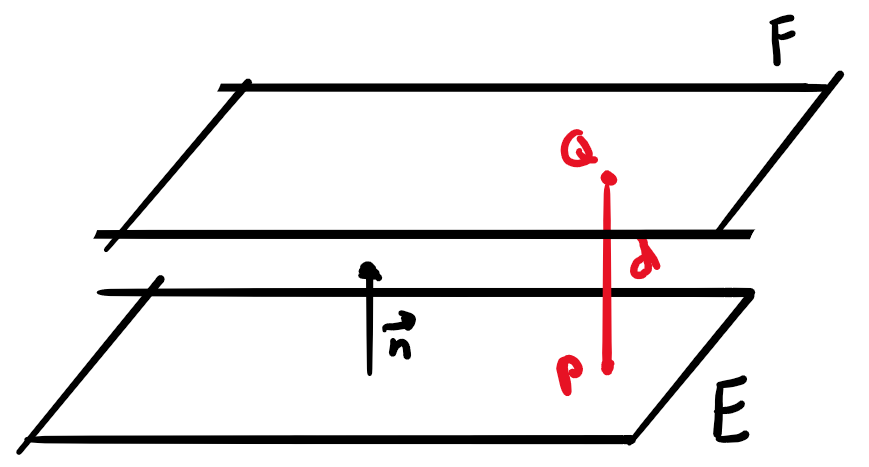
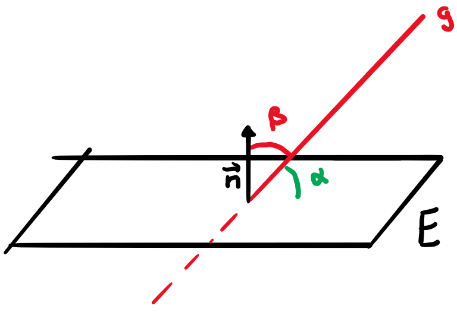

# Die Ebene im Raum

## Parameterform und Koordinatengleichung

### Parameterform

Jeder Punkt in einer Ebene kann durch eine Kombination eines Ortsvektor $\vec{p}$ (Vektor zu einem bekannten Punkt in der  Ebene) und zweier Richtungsvektoren $\vec{u}$ und $\vec{v}$ beschrieben werden:

$$\begin{align}
  \vec{OP}&=\vec{p}+s\vec{u} +t\vec{v}\\
  \left(\begin{array}{c}P_x\\P_y\\P_z \end{array}\right)&=\left(\begin{array}{c}p_x\\p_y\\p_z \end{array}\right) + s\left(\begin{array}{c}u_x\\u_y\\u_z \end{array}\right) + t\left(\begin{array}{c}v_x\\v_y\\v_z \end{array}\right)
\end{align}$$

### Koordinatengleichung

Jeder Punkt in einer Ebene steht senkrecht zum Normalenvektor $\vec{n}$ der Ebene und kann somit durch diesen und einem Ortsvektor $\vec{p}$ beschrieben werden.

$$\begin{align}
  \left(\begin{array}{c}x-p_x\\y-p_x\\z-p_x \end{array}\right)\cdot \left(\begin{array}{c}n_x\\n_y\\n_z \end{array}\right) &= 0 \\
  n_xx+n_yy+n_zz &= n_xp_x + n_yp_y + n_zp_z\\
  Ax+By+Cz &= D
\end{align}$$

Parallele Ebenen besitzen also kollineare Normalenvektoren.

Das Spurendreieck (Dreieck aus den Schnittpunkten mit den Achsen) kann mit Achsenabschnittsgleichung bestimmt werden:

$$\begin{align}
  Ax+By+Cz &= D\\
  \frac{x}{D/A} + \frac{y}{D/B} + \frac{z}{D/C} &=1\\
  \frac{x}{a} + \frac{x}{b} + \frac{x}{c} &= 1
\end{align}$$

## Spezielle Ebenen

### Ebene geht durch den Origo

$$Ax+By+Cz = 0$$

### Ebene ist parallel zur z-Achse

$$Ax+By+0z = D$$

### Ebene ist parallel zur xz-Ebene

$$0x+By+0z = D$$

### Normalebene und Mittelnormalebene

Die Normalebene steht senkrecht zu einer Geraden. Der Richtungsvektor der Geraden ist somit der Normalenvektor der Ebene.

Auf der Mittelnormalebene liegen alle Punkte $P$ mit gleichem Abstand zu $A$ und $B$. Koordinatengleichung mit Normalenvektor $\vec{AB}$ und Mittelpunkt $M$.

### Krumme Flächen

Krumme Flächen haben nicht-lineare Beziehungen zwischen $x$, $y$, und $z$. Bsp.:

$$xy + 3y^2 + 5z = 10$$

## Lösungsideen

### Von der Parameterform zur Koordinatengleichung

1.  Normalenvektor durch das Kreuzprodukt beider Richtungsvektoren bestimmen (steht ja senkrecht) und diesen gegebenenfalls "kürzen"
2.  Ortsvektor in $Ax+By+Cz = D$ einsetzen ($A$, $B$ und $C$ sind schon aus $\vec{n} = \left(\begin{array}{c}A\\B\\C \end{array}\right)$ gegeben) und ausrechnen.

### Koordinatengleichung aus 3 Punkten

1.  Richtungsvektoren aus den 3 Punkten.
2.  Wie in der vorherigen Lösung vorgehen.

### Schnittpunkt der Ebene E und der Geraden g

1.  In der Koordinatengleichung von $E$ für $x$, $y$ und $z$ die Parameterform von $g$ einsetzen
2.  Das so erhaltene $t$ für die Parameterform wieder einsetzen und Punkt berechnen

### Abstand d vom Punkt P zur Ebene E

1.  Gerade $g$ durch $P$ mir Richtungsvektor gleich dem Normalenvektor $\vec{n}$ der Ebene.
2.  Schnittpunkt $S$ von $g$ mit $E$ (Lösung Beispiel vorher)
3.  $d=|\vec{PS}|$

### Koordinatengleichung der Ebene E parallel zur Ebenen F mit Abstand d

1.  Punkt $P$ auf der Ebene $E$ finden mit einem willkürlichen Punkt $Q$ auf $F$. $\vec{OP} = \vec{OF} \pm \lambda\vec{n}$ mit $\lambda|\vec{n}| = d$ ("$\pm$", weil es auf beiden Seiten Lösungen hat)
2.  Koordinatengleichung für $E$ benutzt das gleiche $\vec{n}$ und man setzt $P$ ein, um $D$ zu berechnen.

### Punkt P an Ebene E spiegeln

1.  Abstandsvektor $d$ zwischen $P$ und $E$
2.  $\vec{OP'} = \vec{OS} + \vec{PS} = \vec{OP} + 2\vec{PS}$

### Lichtstrahl l an der Ebene E reflektieren

1.  Punkt $P$ aus der Parameterform der Geraden $l$ an $E$ spiegeln (siehe vorheriges Beispiel)
2.  Schnittpunkt $S$ der Geraden $l$ und Ebenen $E$
3.  Parameterform mit $P'$ und $\vec{P'S}$

### Winkel zwischen 2 Ebenen E und F

1.  Schnittwinkel zwischen den beiden Normalenvektoren bestimmen.

### Winkel zwischen der Geraden g und der Ebene E

1.  $\beta$ ist der Winkel zwischen $g$ bzw. dessen Richtungsvektor und dem Normalenvektor $\vec{n}$
2. $\alpha = 90° - \beta$
3. Wenn $\beta>90°$, dann $\alpha = 180° - \beta$

### Abstand d vom Punkt P zur Geraden g (mit Normalebene)

1.  Normalebene $N$ zu $g$ durch $P$
2.  $N$ mit $g$ schneiden ergibt $D$
3.  $d = |\vec{DP}|$