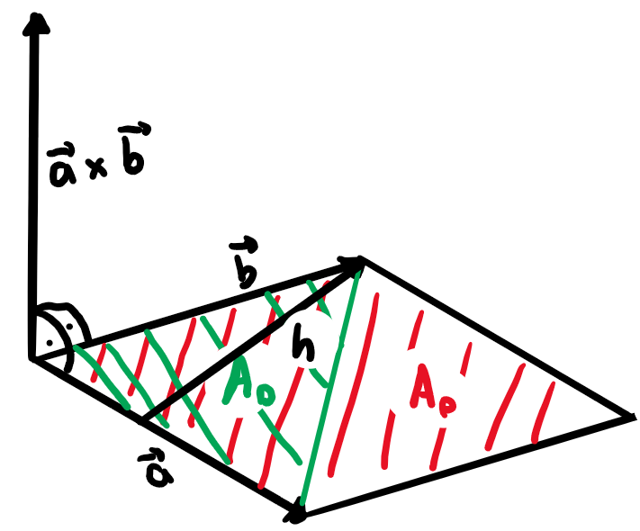
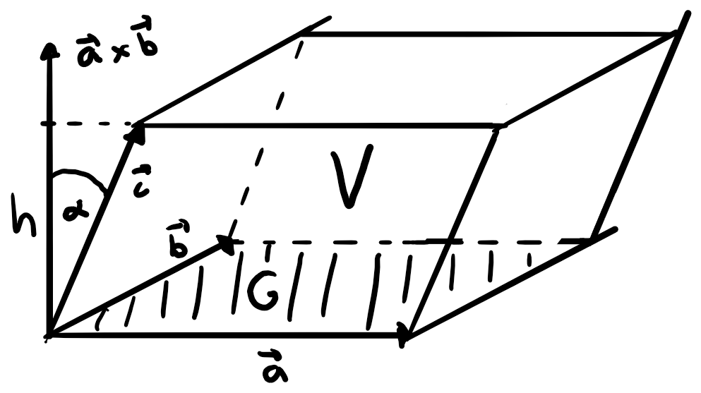

# Skalar-, Vektor- und Spatprodukt

## Skalarprodukt

### Neue Formel

Aus dem Kosinussatz:

$$\begin{align}
  |\vec{a}-\vec{b}|^2&=|\vec{a}|^2 + |\vec{b}|^2 - 2|\vec{a}||\vec{b}|\cos(\alpha)=|\vec{a}|^2 + |\vec{b}|^2 - \vec{a}\cdot\vec{b} \\
  \vec{a}\cdot\vec{b} &= \frac{|\vec{a}|^2 + |\vec{b}|^2 - |\vec{a}-\vec{b}|^2}{2}\\
  &=...\\
  &=a_1b_1+a_2b_2+a_3b_3
\end{align}$$

### Winkel zwischen zwei Vektoren

$$\begin{align}
  \vec{a}\cdot\vec{b} &= |\vec{a}||\vec{b}|\cos(\alpha)\\
  \cos(\alpha) &= \frac{\vec{a}\cdot\vec{b}}{|\vec{a}||\vec{b}|}
\end{align}$$

Wobei das Skalarprodukt nun mit den aus dem Kosinussatz hergeleiteten Komponenten berechnet werden kann.

$$\cos(\alpha) = \frac{a_1b_1+a_2b_2+a_3b_3}{|\vec{a}||\vec{b}|}$$

## Vektor-/Kreuzprodukt

### Idee

"Schöner" Vektor $\vec{n}$ der sowohl zu $\vec{a}$ als auch zum Vektor $\vec{b}$ senkrecht steht.

Folgende Bedingungen müssen erfüllt sein:

1.  $$\vec{n}\cdot\vec{a} = 0$$
2.  $$\vec{n}\cdot\vec{b} = 0$$

1.  $$n_1a_1+n_2a_2+n_3a_3 = 0$$
2.  $$n_1b_1+n_2b_2+n_3b_3 = 0$$

Man kann nun 3. nach $n_1$ auflösen und erhält:

$$n_1=\frac{-n_2a_2-n_3a_3}{a_1}$$

Durch einsetzen von 3. in 4. erhält man nach auflösen:

$$n_2(a_1b_2-a_2b_1) + n_3(a_1b_3-a_3b_1) = 0$$

Dies lässt auf die Lösungen mit $n_2=a_3b_1-a_1b_3$ und $n_3=a_1b_2-a_2b_1$ führen. Schliesslich setzt man das in $n_1$ ein und erhält für $\vec{n}$:

$$\vec{n} = \left(\begin{array}{c}a_2b_3-a_3b_2\\a_3b_1-a_1b_3\\a_1b_2-a_2b_1 \end{array}\right) $$

Dieser Vektor ist das Ergebnis des Vektor-/Kreuzproduktes von $\vec{a}$ und $\vec{b}$:

$$\vec{a}\times\vec{b} = \left(\begin{array}{c}a_2b_3-a_3b_2\\a_3b_1-a_1b_3\\a_1b_2-a_2b_1 \end{array}\right) $$

### Algebra-Gesetze

$$\vec{a}\times\vec{b}\neq\vec{b}\times\vec{a}$$

$$\vec{a}\times(\vec{b} + \vec{c}) = \vec{a}\times\vec{b} + \vec{a}\times\vec{c}$$

$$(\lambda\vec{a})\times\vec{b} = \lambda (\vec{a}\times\vec{b}) = \vec{a}\times(\lambda\vec{b})$$

$$(\vec{a}\times\vec{b})\times\vec{c}\neq\vec{a}\times(\vec{b}\times\vec{c})$$

### Der Betrag des Vektorprodukts

$$\begin{align}
  |\vec{a}\times\vec{b}| &= \sqrt{(a_2b_3-a_3b_2)^2+(a_3b_1-a_1b_3)^2+(a_1b_2-a_2b_1)^2}\\
  &= ... \\
  &= |\vec{a}||\vec{b}|\sin(\alpha)
\end{align}$$

Geometrisch ist das die Fläche des von den Vektoren $\vec{a}$ und $\vec{b}$ aufgespannten Parallelogramms

$$A_P = |\vec{a}\times\vec{b}|$$

Wobei für das Dreieck Folgendes gilt:

$$A_D = \frac{|\vec{a}\times\vec{b}|}{2}$$

Und für die Höhe $h$:

$$h = \frac{|\vec{a}\times\vec{b}|}{|\vec{a}|}$$

## Spatprodukt

Für das Volumen $V_S$ eines Spats gilt also:

$$\begin{align}
  V_S &= G\cdot h\\
  &= ||\vec{a}\times\vec{b}|\cdot|\vec{c}|\cos(\alpha)|=||\vec{a}\times\vec{b}|\cdot\vec{c}|
\end{align}$$

Für Rechts- und Linkssysteme (bei Linkssystemen ist das Ergebnis negativ, da das Kreuzprodukt nach oben zeigt und $\vec{c}$ aber nach unten --> $\cos(180^{\circ}-\alpha) = -\cos(\alpha)$).

Wenn für das Spatprodukt $|\vec{a}\times\vec{b}|\cdot\vec{c}=0$ gilt, befinden sich die Vektoren in der gleichen Ebene sprich sie sind komplanar. (Gl.-Systeme haben dann keine oder unendlich viele Lösungen, wenn ihr Spatprodukt 0 ist. Determinante und Spatprodukt sind dasselbe!)