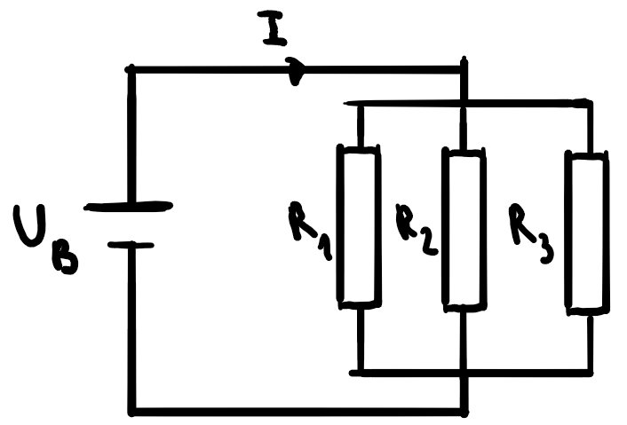

# Elektrizität

## Elektrostatik

### Elektrische Ladung

#### Allgemein

In der Regel werden in allen Körpern die positive Ladung der Atomkerne mit der negativen Ladung der Elektronen ausgeglichen. Materialien, bei denen Elektronen fest sitzen, nennt man Isolatoren (z. B. Gummi). Materialien, bei denen Elektronen frei beweglich sind, nennt man Leiter (z. B. Metalle). Sobald überflüssige Ladung in den Boden abgeführt wird, nennt man es Erdung. 
Ungeladene Körper werden immer von geladenen Körpern angezogen. Bei Leitern entsteht dies, weil sich die Elektronen zum Körper hin oder von ihm wegbewegen. Bei beiden zeigt aber die resultierende Kraft zum geladenen Körper, da sich eine Seite des ungeladenen Körpers näher befindet. Man spricht von Influenz. Bei Nicht-Leitern spricht man von Polarisation.

#### Erhaltungssatz

Im abgeschlossenen System ist die elektrische Ladung konstant

#### Coulombkraft

Ladungen sind quantisiert. Protonen haben die Ladung $e$ und Elektronen $-e$.

Für zwei geladene Körper mit jeweiliger Ladung $Q$ in Abstand $r$ gilt:

$$F_C=C\cdot\frac{|Q_1\cdot Q_2|}{r^2}$$

### Das Elektrische Feld

#### Allgemein

Die Richtung des elektrischen Feldes $E$ im Punkt $P$ mit Ladung $q$ ist die vektorielle Summe aller Coulombkräfte $F_{\textrm{res}}$ der Ladungen $Q$ auf $q$, wobei das elektrische Feld immer von + zu - zeigt. Es gilt also:

$$\vec{E}=\frac{\vec{F_{\textrm{res}}}}{q}$$

#### Homogene Felder

In einem homogenen Feld haben alle $\vec{E}$ die gleiche Länge und Richtung. Bei z. B. einem Plattenkondensator sind in der Mitte die Feldlinien näherungsweise parallel und gleich stark.

#### Felder von geladenen Metallkörpern

Sind Leiter negativ geladen, befinden sich die überschüssigen Elektronen gleichverteilt auf der Oberfläche (günstigste Verteilung). Im Inneren ist also das elektrische Feld 0 und aussen steht es senkrecht zur Oberfläche.

Anwendung davon sind die sogenannten Faraday-Käfige. Elektronen in leitenden Hohlkörpern bei äusserem $\vec{E_\textrm{aussen}}$-Feld bewegen sich in die Richtung, in der im Inneren ein $\vec{E_\textrm{Körper}}$-Feld entsteht, welches das äussere aufhebt, sodass $\vec{E_{\textrm{Total}}}$ im Inneren dann 0 ist.

### Elektrische Spannung

#### Allgemein

Spannungsquellen laden Körper elektrisch auf. (Wie sie genau eingebaut sind später in "Schaltkreise"). Die Spannung $U$ wird definiert als Arbeit, die Ladungseinheit aufgewendet werden muss:

$$U=\frac{W}{q}=E\cdot d$$

Die Spannung ist also so etwas wie $E_{\textrm{pot}}$ pro Coulomb Ladung. Linien mit $U=0$ nennt man Äquipotential-Linien.

#### Beschleunigung

Elektronen können mit einer Beschleunigungsspannung $U_B$ beschleunigt werden, wobei die Energiemenge $q\cdot U_B$ der kinetischen Energie danach entspricht:

$$|q\cdot U_B|=\frac{m}{2}v^2$$

#### Kathodenstrahl-Oszilloskop

Hier werden Elektronen durch einer Kathode und einer Anode mit Loch beschleunigt und von zwei Platten, dem Plattenpaar, falls eine Spannung vorhanden abgelenkt, bis sie auf einen Schirm treffen.

## Elektrodynamik

### Strom

Bewegte geladene Teilchen nennt man Strom. Die Stromstärke $I$ wird dabei als Ladungsmenge $Q$ pro Zeiteinheit $t$ definiert:

$$I=\frac{Q}{t}$$

Es gilt die Richtung der positiv geladenen Teilchen. Elektronen bewegen sich also gegen die Stromrichtung!!!

### Widerstand

#### Allgemein

Elektronen fliessen nicht durch alle Materialien gleich gut. Sie stossen nicht-elastisch mit den Kernen, verlieren Energie, werden schneller und die Temperatur steigt. Der Widerstand $R$ wird als Spannung $U$ pro Stromstärke $I$ definiert:

$$R=\frac{U}{I}$$

#### Ohmscher Widerstand

Falls Widerstände konstant also von Spannung und Stromstärke unabhängig sind, dann sind sie ohmsch. In einem $I$-$U$-Diagramm würde das also einer Geraden entsprechen. 

#### Spezifischer Widerstand

Um den Widerstand $R$ eines Drahtes zu berechnen, braucht man seine Länge $l$, die Querschnittsfläche $A$ und den vom Material abhängenden spezifischen Widerstand $\rho_{\textrm{el}}$:

$$R=\rho_{\textrm{el}}\cdot\frac{l}{A}$$

### Arbeit und Leistung

Für die Leistung $P$ folgt aus der Definition $P=\frac{W}{t}$ und den vorherigen Formeln:

$$P=U\cdot I$$

### Schaltkreise

#### Serienschaltung

Bei einer Serienschaltung ist die Stromstärke $I$ überall gleich. Die Batteriespannung ist die Summe aller einzelnen Spannung. Gleiches gilt für den Widerstand $R$:

$$\begin{align}
	R_{\textrm{tot}}&=\sum R_i\\
	U_{\textrm{tot}}&=\sum U_i\\
	&=I\cdot\sum R_i\\
	&=I\cdot R_{\textrm{tot}}
\end{align}$$

#### Parallelschaltung

Bei einer Parallelschaltung ist die Spannung überall gleich. Die anfängliche Stromstärke ist die Summe aller einzelnen Stromstärken. Für den Widerstand gilt hingegen:

$$\begin{align}
	\frac{1}{R_{\textrm{tot}}}&=\sum \frac{1}{R_i}\\
	I_{\textrm{tot}}&=\sum I_i\\
	&=U_B\cdot \sum \frac{1}{R_i}\\
	&=\frac{U_B}{R_{\textrm{tot}}}
\end{align}$$

#### Kombination

Bei Kombinationen von Parallel- und Serienschaltung, rechnet man in Untergruppen.

