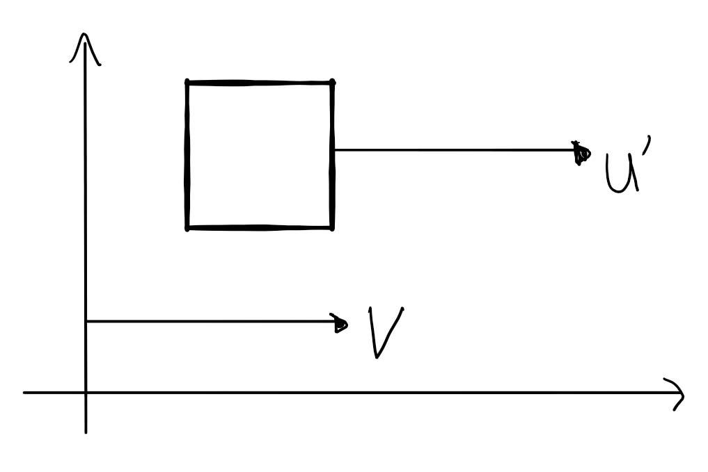

# Physik Formelsammlung

## Kinematik

* Beschleunigungsdistanz: $x = \frac{v^2_2-v^2_1}{2 a}=\frac{v^2_2-v^2_1}{2 \mu_G\cdot g}$
* Beschleunigungszeit: $t = \sqrt{\frac{2 \Delta x}{a}}$
* Bremsverzögerung: $a = \frac{v^2_2-v^2_1}{2 x}$
* Energiesatz: $W_\text{tot} = F_\text{res} \cdot\Delta x = \Delta E_\text{kin}$

## Hydrostatik

* Auftrieb: $\rho_{\text{Gas}}=\frac{p M}{R T}$, wobei $M_{\text{Luft}}=0.029 \text{kg mol}^{-1}$
* Halbkugeln: $F=\Delta p\cdot A$

## Thermodynamik

* Durchschnittliche kinetische Energie: $\bar{E_{\textrm{kin}}}=\frac{3}{2}\cdot\frac{R}{N_A}\cdot T$
* Gleichgewicht: $\frac{p_1\cdot V_1}{T_1\cdot n_1}=\frac{p_2\cdot V_2}{T_2\cdot n_2}$

## Elektrodynamik

* Spannungsabfall bei Kabel, Verbraucherwiderstand: $U' = U - R_1 \frac{U}{R_1 + R_2}$
* Kirchhoff'sche Regeln: 
  * An Knotenpunkten beträgt die Summe aller ein- und ausfliessenden Ströme null: $\sum_{k=1}^{n} I_k = 0$
  * Alle Teilspannungen eines Umlaufs addieren sich zu null: $\sum_{k=1}^{n} U_n = 0$
* Addition von Widerständen in Parallel-Schaltung: $R_{\text{eq}} = \frac{1}{\frac{1}{R_1} + \frac{1}{R_2}} = \frac{R_1 R_2}{R_1 + R_2}$
* Weiteres zu Serien-Schaltung:

$$\begin{align}
	I&\;\textrm{bleibt gleich}\\
	U_{\textrm{tot}}&=\sum U_i\\
	U_1:U_2:U_3:...&=R_1:R_2:R_3:...
\end{align}$$

* Weiteres zu Parallel-Schaltung:

$$\begin{align}
	I_{\textrm{tot}}&=\sum I_i\\
	U&\;\textrm{bleibt gleich}\\
	I_1:I_2:I_3:...&=\frac{1}{R_1}:\frac{1}{R_2}:\frac{1}{R_3}:...
\end{align}$$

## Lenz'sche Regel (Fluss)

* Erzeugt ein (den **Vorgang** hemmendes) Magnet-Feld
  * beim Einschieben entgegen $\vec{B}$
  * beim Herausnehmen mit $\vec{B}$

## Kernphysik

* $A \rightarrow$ Kernbestandteile $n + p^+$
* $Z \rightarrow$ Protonen
* Bindungsenergie: $E_B = [ Z\cdot m_P + (A – Z)\cdot m_N – m(A,\;Z) ]\cdot c^2$
* $\alpha$ - Zerfall (Helium-Kern): $^A_ZX \xrightarrow {\alpha} ^{A - 4}_{Z - 2}Y + ^4_2\textrm{He}^{2+}+2e^-$
* $\beta$-Zerfall (Neutron $\rightarrow$ Proton und Elektron): $^A_ZX \xrightarrow {\beta} _{Z + 1}^{\;\;A}Y + e^-$
* Anzahl Halbwertszeiten: $n=\frac{t}{T_{1/2}}$
* $N = \frac{\text{Masse des Stoffs}}{\text{Kernmasse}}$
* Arbeit Wärmearbeitsmaschine (Erzeugte Wärmemenge $Q_1$ und abgegebene Wärmemenge $Q_2$): $W=P\cdot t= Q_1 - Q_2$ mit Wirkungsgrad: $\eta=\frac{W}{Q_1}<_\textrm{(ideal)}\frac{T_1-T_2}{T_1}$

## Wellen/Akustik

* Einzelspalt: $\sin(\alpha_{\textrm{min}})=n\cdot\frac{\lambda}{s}$
* Saiteninstrumente, offene Pfeifen: 

$$\begin{align}
	\lambda_0&=2L\\
	f_0&=\frac{v}{2L}\\
	\lambda_n&=\frac{2L}{n+1}
\end{align}$$

* Gedackte Pfeifen $\rightarrow$ tiefer: 

$$\begin{align}
	\lambda_0 &= 4L\\
	f_0&=\frac{v}{4L}\\
	\lambda_n&=\frac{4L}{2n+1}
\end{align}$$

* Schallgeschwindigkeit: 

$$\begin{align}
	v_l &= \sqrt{\frac{R\cdot T\cdot\kappa}{M}}\\
	R &\approx 8.31 J\cdot K^{-1} \text{mol}^{-1}\\
	T &= \text{Temperatur in K}\\
	M &= \text{Molmasse in kg mol}^{-1}\\
	&\text{1-atomige Gase: } \kappa = \frac{5}{3}\\
	&\text{2-atomige Gase: } \kappa = \frac{7}{5} 
\end{align}$$

* Akustischer Doppler:

$$\begin{align}
	\textrm{Quelle bewegt sich zur Person}:&&f'=\frac{c}{c-v}\cdot f\\
	\textrm{Quelle bewegt sich von Person weg}:&&f'=\frac{c}{c+v}\cdot f\\
	\textrm{Person bewegt sich zur Quelle}:&&f'=\frac{c+v}{c}\cdot f\\
	\textrm{Person bewegt sich von Quelle weg}:&&f'=\frac{c-v}{c}\cdot f
\end{align}$$

* Machkegel: $\sin(\alpha)=\frac{c}{v}$ mit $\alpha=\frac{1}{2}$ Öffnung

## SRT

* Rotverschiebung: Entfernung, grosses $\lambda$
* Blauverschiebung: Annäherung, kleines $\lambda$
* $f = f'\sqrt{\frac{1 + \beta}{1-\beta}}$
* $\frac{f}{f'}=\frac{\lambda'}{\lambda}=k$
* $\beta = \sqrt{\frac{k^2-1}{k^2+1}}$
* $\gamma = \frac{1}{\sqrt{1-\beta^2}} > 1$
* $\beta=\sqrt{1 - \frac{1}{\gamma^2}}$
* Zeitdilatation: "Bewegte Uhren gehen langsamer"
* $t' = \gamma\cdot t_0$ mit $t'$ als Beobachter; $t$ Eigenzeit
* Längenkontraktion: "Bewegte Massstäbe sind kürzer"
* $l' = \frac{l_0}{\gamma}$ mit $l$ als Eigenlänge und $l'$ als beobachtete Länge
* Geschwindigkeitsaddition: $u = \frac{v + u'}{1 + \frac{v\cdot u'}{c^2}}$

* Impulserhaltung ($p=\gamma \cdot m_0\cdot v$): $\gamma_1 m_{0,1} v_1 + \gamma_2 m_{0,2} v_2 = \gamma_1'm_{0,1}v_1' + \gamma_2'm_{0,2}v_2'$
* Desynchronisation (mit $x_2'-x_1'$ = Distanz im Ruhesystem der Uhren): $\Delta t = \frac{v}{c^2}(x_2'-x_1')=\frac{v}{c^2} \Delta s'$
* Gesamtenergie eines Körpers (bleibt erhalten): $E_{\text{tot}}=mc^2=\gamma m_0c^2$
* Ruheenergie: $E_0=m_0c^2$
* $E_{\text{kin}}=E_{\text{tot}}-E_0=(\gamma -1)m_0c^2 = qU$
* $E^2=m_0^2c^4+p^2c^2$
* $E^2-p^2c^2$ ist invariant!
* $(ct)^2-x^2$ bleibt in allen Systemen invariant
* Kreisbewegung: $F_{\text{res,rad}}=\gamma\cdot m_0 \frac{v^2}{r}=F_{\text{Lorentz}} = q\cdot v\cdot B$
* $\gamma\cdot m_0\cdot v = q\cdot r\cdot B$
* Für $v<<c$: $\gamma\approx 1+\frac{v^2}{2c^2}$

## ART

* Grav. Dopplereffekt:
  * Unten ist die Uhr langsamer 
  * $f_{\text{oben}} = f_{\text{unten}} \sqrt{\frac{1-\beta}{1 +\beta}}$
  * $f_{\text{oben}} = f_{\text{unten}}(1-\frac{gh}{c^2})$
  * $\Delta f = \frac{gh}{c^2}\cdot f_{\textrm{unten}}$ 

## QM

* Unschärfen: 
  * $\Delta p \Delta x \geq h$
  * $\Delta E \Delta t \geq h$
* De Broglie: $\lambda=\frac{h}{m\cdot v}=\frac{h}{\sqrt{2m\cdot E_{\textrm{kin}}}}$
* Tunneling: 

$$\begin{align}
	d \sqrt{E_{\text{Bar}}} &\leq h\sqrt{\frac{2}{m}}\\
	\Delta t&\approx\frac{h}{\Delta E}=\frac{h}{m\cdot c^2}
\end{align}$$

* Strahlungsdruck am Spiegel: $p = 2 \frac{I}{c}$
* Photonenrate: $P_{\textrm{Rate}}=\frac{P}{E}=\frac{A\cdot I}{E}$
* Bohr'sches Atommodell: $r = \frac{4\pi\epsilon_0\hbar^2}{e^2m} n^2=n^2\cdot 5.3\cdot 10^{-11}\textrm{m}$
* $E_{\text{tot}}= -\frac{m e^4}{8 \epsilon_0^2h^2} \cdot\frac{1}{n^2} = 13.6\text{eV} \cdot\frac{1}{n^2}$

