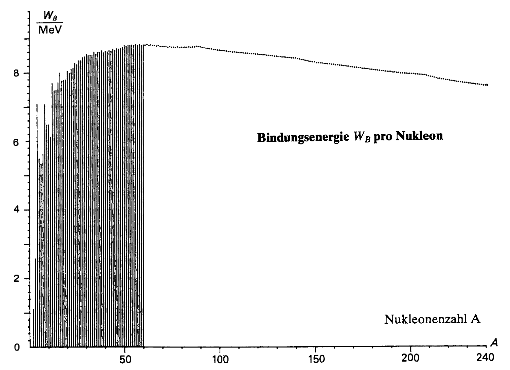

# Kernphysik

## Der Atomkern

Ein Atomkern besteht aus Protonen und Neutronen. Die Protonen sind positiv geladen und Neutronen haben keine Ladung, d. h. sie sind elektrisch neutral. Protonen und Neutronen werden als Nukleonen bezeichnet. Ein Atomkern wird mit dem Symbol $^A_Z X$ charakterisiert, wobei $X$ der Stoff ist, $A$ die Nukleonenzahl und $Z$ die Ordnungszahl. Für die Neutronenzahl $N$ gilt demnach $N=A-Z$.

## Die Kernkraft und die Stabilität der Atomkerne

Im Atomkern besteht ein Stabilitätsproblem, weil die Protonen sich gegenseitig elektrisch abstossen. Die Atomkerne müssen also durch eine Kraft zusammengehalten werden, welche nicht elektrischer Natur ist. Diese Kraft nennt man Kernkraft oder starke Wechselwirkung.

Atomkerne sind leichter als die Summe ihrer Bestandteile. Es herrscht also ein Massendefekt $\Delta m$. Wenn man Kerne in ihre Bestandteile zerlegt, so muss man Arbeit verrichten, um die Kernkraft zu überwinden. Der Massendefekt entspricht also der Bindungsenergie $E_B$ des Kerns nach Einstein:

$$E_B=\Delta m\cdot c^2$$

Allgemein gilt für die Masse $m(A,\; Z)$ eines Kerns die Beziehung:

$$m(A,\;Z) = Z\cdot m_P + (A – Z)\cdot m_N – \Delta m$$

Für die Bindungsenergie:

$$E_B = [ Z\cdot m_P + (A – Z)\cdot m_N – m(A,\;Z) ]\cdot c^2$$

Als Mass für die Stabilität von Atomkernen kann die Bindungsenergie pro Nukleon betrachtet werden: Diese entspricht der Arbeit, welche erforderlich ist, um ein einziges Nukleon aus dem Kernverband zu lösen. Je grösser die Bindungsenergie pro Nukleon ist, um so stabiler ist ein Kern! Wichtiger Graph:

## Radioaktivität

### Alphastrahlung

$\alpha$-Strahlung (Helium-4-Kerne) kommt in der Luft nur einige cm weit. Sie ist eine Folge der Instabilität von schweren Atomkernen. Es gilt:

$$(A,\;Z) → (A – 4,\;Z – 2) + \alpha$$

### Betastrahlung

$\beta$-Strahlung sind Elektronen die aus der Spaltung eines Neutrons in ein Proton, dem Elektron und einem (Anti-)Neutrino entstehen $n\rightarrow p+e+\bar{v}$. Schuld ist die sogenannte schwache Kernkraft. Es gilt (Neutrinos ignorieren wir):

$$(A,\;Z) → (A,\; Z + 1) + \beta$$

### Gammastrahlung

$\gamma$-Strahlung sind energiereiche elektromagnetische Wellen, die Materie am leichtesten durchdringen. Entsteht aus der überschüssigen Energie nach einem $\alpha$- oder $\beta$-Zerfall. $A$ und $Z$ bleiben gleich.

### Zerfall

Für die Aktivität $A(t)$ (Anzahl Kern-Zerfälle pro Sekunde) mit der Halbwertszeit $T_{1/2}$ gilt:

$$A(t)=A_0\cdot 2^{-\frac{t}{T_{1/2}}}$$

Die Anzahl Halbwertszeiten $n$ hat:

$$n=\frac{t}{T_{1/2}}$$

Für die Anzahl radioaktiver Kerne $N(t)$ mit der Halbwertszeit $T_{1/2}$ gilt:

$$N(t)=N_0\cdot 2^{-\frac{t}{T_{1/2}}}$$

Für den Zusammenhang zwischen $A$ und $N$ gilt:

$$A=\frac{N\cdot \ln(2)}{T_{1/2}}$$

## Die Kernspaltung

Kernspaltungen entstehen, wenn Elektronen mit langsamer Geschwindigkeit auf einen Kern treffen. Es entsteht zuerst ein instabiler Zwischenkern und anschliessend Tochterkerne und 2-3 Elektronen. Es folgt eine Kettenreaktion, wenn diese Elektronen genug verlangsamt werden. Bei der Kernspaltung bleiben die Gesamtzahlen von der Protonen und der Neutronen konstant. Damit überhaupt die Kernspaltung entsteht, brauch es eine sogenannte kritische Masse vom Stoff, damit die Trefferchance gross genug ist.

## Das Kernkraftwerk

Kernkraftwerke sind Wärmearbeitsmaschinen. Für die Arbeit $W$ über einen Zeitraum $t$ mit Leistung $P$ oder mit der erzeugten Wärmemenge $Q_1$ und der an die Umgebung abgegebenen Abwärme $Q_2$ gilt:

$$W=P\cdot t= Q_1 - Q_2$$

Sie haben also einen Wirkungsgrad $\eta$:

$$\eta=\frac{W}{Q_1}=\frac{T_1-T_2}{T_1}$$

Im Idealfall also $\eta=1$ aber bei Kernkraftwerken zwischen 30%-35%.

