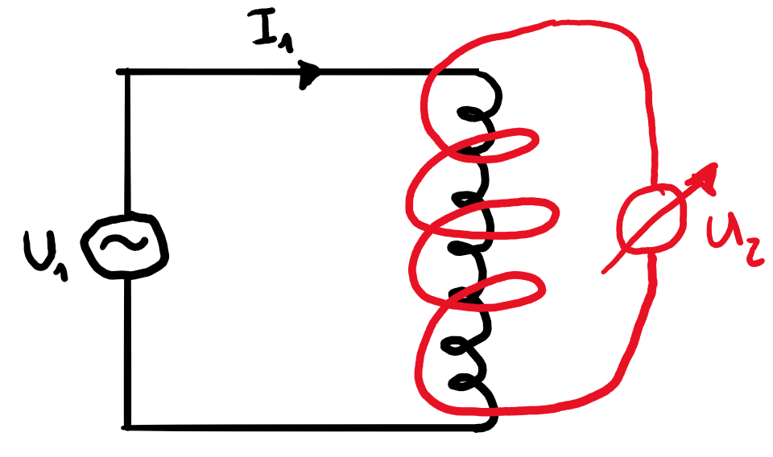
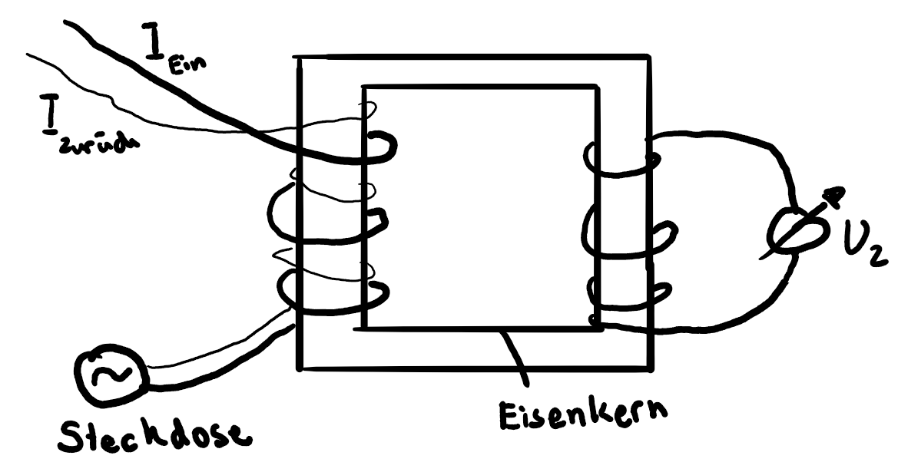

# Magnetismus

## Das Magnetfeld

### Allgemein

In der Umgebung von Magneten entstehen Magnetfelder $\vec{B}$, mit $\vec{B}$-Vektoren tangential zu den Feldlinien und der Richtung von N-Pol zum S-Pol. Homogene Felder sind gleich definiert wie beim elektrischen Feld (Gleiche Richtung, gleiche Länge) und ein Beispiel hierfür wäre annähernd im Inneren eines Hufeisens. Im Gegensatz zum elektrischen Feld sind aber magnetische Feldlinien immer geschlossen.

### Erzeugung mit Strom

Um gerade stromführende Leiter bilden sich auf einer zum Draht senkrechten Ebene Feldlinien auf konzentrischen Kreisen. Für den Umlaufsinn gilt die Richtung der Finger der rechten Hand, wenn der Daumen in die Stromrichtung zeigt.

Handelt es sich um eine Spule dann sehen die Feldlinien wie bei einem Magneten aus mit einem homogenen Feld in der Spule. Für den Umlaufsinn im Inneren gilt die Richtung des Daumens der rechten Hand, wenn die Finger die Stromrichtung der Windungen anzeigen. 

### Magnetisches Feld in einer Spule

Für $B$ in einer Spule mit der magnetischen Feldkonstante $\mu_0$, der Stromstärke $I$ und der Windungsdichte $\frac{N}{l}$ (Windungen pro Länge der Spule) gilt:

$$B=\mu_0\cdot I\cdot\frac{N}{l}$$

## Lorentzkraft

### Leiter

Die Lorentzkraft $F_L$ steht senkrecht zur Stromrichtung und dem $\vec{B}$-Feld. Für die Richtung gilt der Mittelfinger der rechten Hand, wenn der Daumen die Stromrichtung und der Zeigefinger das $\vec{B}$-Feld anzeigen. Für $F_L$ mit der Stromstärke $I$, der Stärke des Magnetfeldes $\vec{B}$, der Länge $l$ des Leiters im Magnetfeld und dem Winkel $\alpha$ zwischen Feld und Stromrichtung gilt:

$$\begin{align}
	\vec{F_L}&=I\cdot\vec{l}\times\vec{B}\\
	F_L&=I\cdot l\cdot B\cdot\sin(\alpha)
\end{align}$$

Zeigt eine Richtung in die Skizze hinein, wird $\otimes$ als Symbol verwendet. Zeigt sie aus der Skizze hinaus, wird $\odot$ verwendet.

### Bewegte geladene Teilchen

Die Lorentzkraft $F_L$ auf ein bewegtes geladenes Teilchen $q$ mit Geschwindigkeit $\vec{v}$ im Feld $\vec{B}$ gilt:

$$\begin{align}
	\vec{F_L}&=q\cdot\vec{v}\times\vec{B}\\
	F_L&=q\cdot v\cdot B
\end{align}$$

Für die Richtung gilt der Mittelfinger der rechten Hand, wenn der Daumen den Geschwindigkeitsvektor und der Zeigefinger das $\vec{B}$-Feld anzeigen, falls $q>0$ gilt. Für Elektronen also zeigt $F_L$ in die entgegengesetzte Richtung bzw. man nimmt die linke Hand.

## Induktion

### Magnetischer Fluss

Der magnetische Fluss $\Phi$  ist definiert, als der Fluss eines $\vec{B}$-Feldes durch eine vom Leiter eingegrenzte Fläche $A$, wobei $\alpha$ der Winkel zwischen $\vec{B}$ und der Flächennormalen ist:

$$\Phi=\vec{B}\cdot\vec{A}=B\cdot A\cdot\cos(\alpha)$$

### Das Induktionsgesetz

#### Allgemein

Wenn sich der magnetische Fluss ändert, wird eine Spannung $U_{\textrm{ind}}$ induziert. Handelt es sich um eine Spule, dann zählt die Fläche um die Anzahl Windungen $n$ mal mehr. Bei einer Fläche also $n=1$:

$$U_{\textrm{ind}}=-n\cdot\frac{\Delta\Phi}{\Delta t}$$

Es ist also dann Spannung vorhanden, wenn sich das $\vec{B}$-Feld, die Fläche oder der Winkel dazwischen (z. B. durch Drehen) ändert.

Es entsteht also ein Strom $I_{\textrm{ind}}$ mit dem Widerstand $R$ des Stromkreises:

$$I_{\textrm{ind}}\approx\frac{U_{\textrm{ind}}}{R}$$

#### Lenzsche Regel

Der induzierte Strom fliesst immer so, dass der induzierende Vorgang gebremst wird. Darum auch das $-$ in der Formel von $U_{\textrm{ind}}$.

### Beispiele

#### Wechselspannung-Generator

Bei einem Wechselspannung-Generator haben wir eine sich drehende Spule. Es gilt also $\alpha=\omega\cdot t$, wobei $\omega$ die Winkelgeschwindigkeit ist, die auch abhängig von der Frequenz mit $2\pi\cdot f$ ausgedrückt werden kann. Wir haben $\Phi=A\cdot B\cdot \cos(\omega t)$. Aus dem Induktionsgesetz folgt:

$$\begin{align}
	U_{\textrm{ind}}&=-n\cdot\frac{d\Phi}{dt}\\
	&=n\cdot A\cdot B\cdot\omega\cdot\sin(\omega t)
\end{align}$$

Es handelt sich also um sinusförmigen Wechselstrom mit Amplitude $U_0=n\cdot A\cdot B\cdot\omega$.

#### Transformator 

Um die Windungen $N_1$  (Primärspule) eines Stromkreises mit Wechselspannung $U_1$ und Wechselstrom $I_1$ wird eine zweite Spule (Sekundärspule) mit $N_2$ Windungen angelegt. Durch das ständig wechselnde $\vec{B}$-Feld durch den Wechselstrom, wird in die zweite Spule eine Spannung $U_2$ induziert. $U_2$ hat also dieselbe Frequenz wie $U_1$. Beim idealen Transformator gilt:

$$\frac{U_2}{U_1}=\frac{N_1}{N_2}$$

und 

$$U_1\cdot I_1=U_2\cdot I_2$$

Ein Anwendungsbeispiel wäre der Fehlerstromschutzschalter. 

Wenn jemand eine Gabel in die Steckdose steckt, dann geht ein Teil von $I$ in den Boden. Für den Schalter gilt dann $I_{\textrm{zurück}}<I_{\textrm{ein}}$, was dazu führt, dass eine Spannung $U_2$ in die Sekundärspule induziert wird.

