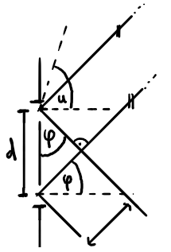

# Quantenphysik

## Einführung

### Probleme der klassischen Physik

- klassische Elektrodynamik sagt, dass die $e^-$ durch ihre beschleunigte Bewegung um das Atom Energie in Form von elektromagnetische Wellen abstrahlen --> Atome sind instabil!?
- Wieso besitzen Linienspektren scharfe Linien und wieso nicht weisses Licht ?
- Der Photoeffekt:

Licht kann Elektronen aus einer Metallplatte herauslösen, wobei die Grenzspannung (Keine Elektronen erreichen die gegenüberliegende Platte) unabhängig von der Intensität des Lichts ist. Es folgt aufgrund der entstehenden Linearität zwischen $E_{kin}$ der Elektronen und der Frequenz $f$ des Lichts, dass dessen Energie nur von $f$ abhängig ist. Es folgt also:

$$E_{kin}=h\cdot f-W$$

Wobei $h$ die Steigung und $W$ die Austrittsarbeit (materialabhängig) ist.

### Was ist Licht?

- Welle: Doppelspalt, Gitter und Interferenzmuster

- Teilchen: Photonen mit

$$E=h\cdot f=p\cdot c$$

$$p=\frac{h\cdot f}{c}=\frac{h}{\lambda}$$

Quantenobjekte:
: Objekte die sowohl Eigenschaften von Wellen als auch von Teilchen aufweisen. Sie werden durch Wahrscheinlichkeitswellen beschrieben.

### Licht-Mikroskop

<!---->

$$\sin(\varphi)=\frac{\lambda}{d}$$

$$1>\sin(u)>\frac{\lambda}{d}$$

### Teilchen sind auch Wellen

- Wenn Elektronen an einer Graphit-Schicht apprallen entstehen keine "Flecken" sondern konzentrische Kreise / Interferenzmuster --> Elektronen sind Quantenobjekte
- Für Teilchen gilt nach De Broglie also:

$$p=\frac{h}{\lambda}$$

$$\lambda=\frac{h}{m\cdot v}=\frac{h}{\sqrt{2m\cdot E_{kin}}}$$

- $e^-$-Beugung am Graphit (mit $E_{kin}=e\cdot U$)

$$\lambda=\frac{h}{\sqrt{2m\cdot e\cdot U}}$$

[Skizze]

$$n\cdot\lambda=2d\cdot \sin(\alpha)$$

- Elektronenmikroskop (von der Logik her gleich wie das Licht-Mikroskop, wobei die Brechungsgrenze deutlich tiefer liegt.)

$$\sin(u)=0.01$$

## Unschärfe, Tunneleffekt & Co.

- Jede Messung zerstört das zu untersuchende Objekt. Auch Photonen haben Impuls.
- Sowohl deBroglie-Längen als auch die Unschärferelation würden die klassische Physik (Instabilität) "retten"

### Die Unschärferelation für Ort und Impuls

[Skizze]

$$\Delta x\cdot \Delta p_x\geq h$$

Je genauer der Ort, desto ungenauer der Impuls und umgekehrt!

### Die Unschärferelation für Zeit und Energie
 (ohne Herleitung)

$$\Delta E\cdot \Delta t\geq h$$

Je genauer der Zeitpunkt einer Messung bestimmt wurde, desto ungenauer kennt man die Energie und umgekehrt!

### Der Tunneleffekt

Aus der Unschärferelation für Zeit und Energie folgt anschliessend:

$$\Delta t\approx\frac{h}{\Delta E}=\frac{h}{mc^2}$$

Teilchen mit Masse $m$ können für einen Zeitraum $\Delta t$ entstehen und wieder verschwinden --> virtuelle Teilchen

Die folgende Tunnelbedingung gilt zur Überwindung der Energie $E_{Barr}$ einer Barriere mit Distanz $d$:

$$d\sqrt{E_{Barr}}\leq h\sqrt{\frac{2}{m}}$$

Alle Wechselwirkungen werden in der modernen Physik mit virtuellen Teilchen beschrieben.

## Atommodelle

Vorbemerkung:

$$E_{pot}=\int F_C \,dr$$

### Das Bohr-Modell

#### Idee

$e^-$ kreist in stehenden Wellen um den Kern.

Bedingung:

$$2\pi r=n\cdot \lambda_{Elektron}$$

Wenn das in die Gleichung für $F_{res,rad}$ eingesetzt wird folgt:

$$r=\frac{4\pi\varepsilon_0\hbar}{e^2m}\cdot n^2\sim n^2$$

mit

$$\hbar=\frac{h}{2\pi}$$

#### Energie

Wenn dies nun für $E_{kin}$ und $E_{pot}$ eingesetzt wird, erhalten wir:

$$E_{tot}=E_{pot}+E_{kin}=\frac{1}{2}E_{pot}=-\frac{m\cdot e^4}{8\varepsilon_0^2h^2}\cdot\frac{1}{n^2}\sim-\frac{1}{n^2}$$

Daraus folgt:

$$E_{Grundzustand}=-13.6\mathrm{eV}$$

Um von den Zuständen zu springen gilt:

$$h\cdot\frac{c}{\lambda_{Ph}}=\frac{m\cdot e^4}{8\varepsilon_0^2h^2}\cdot\left | \frac{1}{n_1^2}-\frac{1}{n_2^2}\right |$$

#### Problem

Unschärferelation wird verletzt, da man in radialer Richtung sowohl Impuls als auch Position kennt.

### 2tes Atommodell (Nur mit Unschärferelation)

#### Idee

$e^-$ ist um den Kern "verschmiert" mit:

$$\Delta r\cdot\Delta p\geq\hbar$$

#### Energie

Für die Energie gilt:

$$E_{tot}=E_{pot}+E_{kin}=-\frac{e^2}{4\pi\varepsilon_0r}+\frac{\hbar^2}{2m\cdot r^2}$$

Für den Mindestradius kommen wir durch ableiten auf den Bohr'schen Radius:

$$r_{min}=\frac{4\pi\varepsilon_0\hbar^2}{m\cdot e^2}$$

Daraus folgt, dass die Grundzustände beider Modelle identisch sind.

#### Nachteil
Keine Quantisierung

#### Gesucht

Modell mit Quantisierungund Unschärferelation

### Franck-Hertz-Experiment

Elektronen, die mit gewisser Spannung durch eine Gaswolke durchgeschossen werden. Sobald sie genug Spannung haben, geben sie diese den Gasatomen ab, verlieren also ihre Energie und bleiben stehen --> Strom fliesst nicht mehr.

Anschliessend ist die Spannung / Energie so gross, dass die Elektronen wieder fliessen, bis sie erneut genug Energie besitzen.
