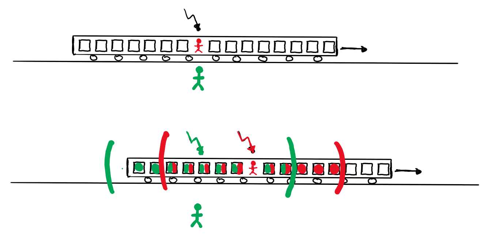

# Relativitätstheorie

## Spezielle Relativitätstheorie

### Abkürzungen

$$\begin{align}
	\gamma&=\frac{1}{\sqrt{1-\frac{v^2}{c^2}}}\\
	\beta&=\frac{v}{c}
\end{align}$$

### Einsteins Postulate

#### Das Ätherproblem

Das Michelson-Interferometer hat gezeigt (Interferenzmuster von Licht ändert sich nicht mit der Drehung), dass Licht kein Medium braucht um sich fortzupflanzen. Das erste Postulat besagt, dass die Lichtgeschwindigkeit $c$ also für alle Beobachter gleich.

#### Inertialsysteme

Inertialsysteme sind Koordinatensysteme, in dem sich ein Körper, auf dem keine Kraft wirkt, mit konstanter Geschwindigkeit bewegt. Das zweite Postulat besagt, dass die Gesetze der Physik in allen Inertialsystem gleich sind. Es gibt keine speziellen Inertialsysteme mit unterschiedlichem $c$.

### Gleichzeitigkeit

Wenn ein Lichtimpuls von der Mitte zweier Objekte gesendet werden und zur gleichen Zeit bei den Objekten ankommen, dann spricht man von Gleichzeitigkeit. Sie hängt aber vom Inertialsystem ab und ist somit relativ. Hilfreich ist folgende Überlegung: Sobald ein Lichtstrahl ausgesendet wurde, bleibt der Ausgangspunkt gleich relativ zu meinem Inertialsystem. Bsp.:

### Zeitdilatation

"Bewegte Uhren gehen langsamer":

$$\Delta t = \Delta t_0\gamma$$

Wobei $t_0$ die Zeit der Uhr in dem System ist, in welchem sie ruht (Eigenzeit). Die Zeit ist also auch nicht absolut, sondern relativ.

### Längenkontraktion

"Bewegte Massstäbe sind kürzer (in Bewegungsrichtung)":

$$l = \frac{l_0}{\gamma}$$

Wobei $l_0$ die Länge des Objektes in dem System ist, in welchem es ruht (Eigenlänge). Längen sind also auch nicht absolut, sondern relativ.

Achtung: Messen ist nicht das gleiche wie sehen!

### Der optische Dopplereffekt

Es gilt:

$$\begin{align}
	f&=f'\sqrt{\frac{c-v}{c+v}}=f'\sqrt{\frac{1-\beta}{1+\beta}}&&\textrm{(Entfernen)}\\
	f&=f'\sqrt{\frac{c+v}{c-v}}=f'\sqrt{\frac{1+\beta}{1-\beta}}&&\textrm{(Annähern)}
\end{align}$$

Beim Entfernen wird die Frequenz kleiner (Rotverschiebung) und beim Annähern wird sie grösser (Blauverschiebung).

### Lorentz-Transformation

#### Allgemein

Um zwischen zwei Inertialsystemen rechnen zu können, wird die Lorentz-Transformation verwendet:

$$\begin{align}
	x'&=\gamma(x-v\cdot t)\\
	t'&=\gamma(t-\frac{v\cdot x}{c^2})\\
	&\textrm{und}\\
	x&=\gamma(x'+v\cdot t')\\
	t'&=\gamma(t'+\frac{v\cdot x'}{c^2})\\
\end{align}$$

#### Geschwindigkeitsaddition

Ein Objekt hat eine Geschwindigkeit $u'$ in einem Inertialsystem $I'$, welches sich mit der Geschwindigkeit $v$ bewegt. Für die Geschwindigkeit $u$ aus der Perspektive von $I$ gilt:

$$u=\frac{u'+v}{1+\frac{u'\cdot v}{c^2}}$$

### Desynchronisation

Für $I'$ synchronisierte Uhren mit Abstand $\Delta x'$ in $I'$ sind für $I$ asynchron mit:

$$\frac{v}{c^2}\cdot \Delta x'$$

### Lorentzkraft

Die Lorentzkraft $F_L$ ist ein relativistischer Effekt. Für eine sich bewegende Ladung $q$ ist ein stromführender Leiter so verkürzt, dass der Leiter aus ihrem Inertialsystem geladen ist.

### Masse und Energie

Für Massen gilt "Bewegte Massen sin schwerer":

$$m=m_0\cdot \gamma$$

Wobei $l_0$ die Masse des Objektes in dem System ist, in welchem es ruht (Ruhemasse). Für den Impuls gilt dann:

$$p=m_0\cdot \gamma\cdot v$$

Für die Energie $E$ gelten:

$$\begin{align}
	E&=m\cdot c^2=m_0\cdot \gamma\cdot c^2\\
	E&=E_0+E_{\textrm{kin}}=m_0\cdot c^2+\frac{1}{2} \cdot v^2 \cdot m_0
\end{align}$$

Masse und Energie sind also äquivalent.

### Erhaltungssätze

In der speziellen Relativitätstheorie bleiben die Gesamtenergie und der Gesamtimpuls erhalten. Weitere invariante Grössen sind die quadrierte Ruhemasse $E_0^2=m_0^2\cdot c^4$ und $(c\cdot t)^2-x^2=(c\cdot t')^2-x'^2$

## Allgemeine Relativitätstheorie

### Äquivalenzprinzip

Homogene Gravitationsfelder wirken äquivalent zu Trägheitskräften, können also nicht unterschieden werden. Dass Licht also in einem beschleunigten System wegen der Trägheit "gekrümmt" wird, bedeutet, dass auch die Gravitation Licht krümmt.

### Rotverschiebung im Gravitationsfeld

In einer nach oben beschleunigten Rakete wird ein Lichtstrahl der am Boden abgeschossen wurde rotverschoben (Doppler). Die Formel für den Doppler kann man annähernd für Geschwindigkeiten wie folgt aufschreiben:

$$f_{\textrm{oben}}\approx f_{\textrm{oben}}\cdot (1-\frac{g\cdot h}{c})$$

Das gilt also wegen dem Äquivalenzprinzip auch für das Gravitationsfeld.

### Uhren im Gravitationsfeld

Weil Uhren auch als Frequenzen angesehen werden können, gilt auch hier:

$$f_{\textrm{oben}}\approx f_{\textrm{oben}}\cdot (1-\frac{g\cdot h}{c})$$

Uhren im Gravitationsfeld sind anders als bei der SRT nicht symmetrisch, d. h., dass die Frequenz der Uhr klar ist und nicht vom Inertialsystem abhängt. Das liegt daran, dass auch die Richtung des Gravitationsfeldes immer klar ist.

### Raumkrümmung

Die Tatsache, dass Licht im Gravitationsfeld gekrümmt wird, hat als Interpretation, dass Gravitation den Raum krümmt, das Licht sich also gerade in einem krummen Raum bewegt und deswegen gekrümmt scheint.